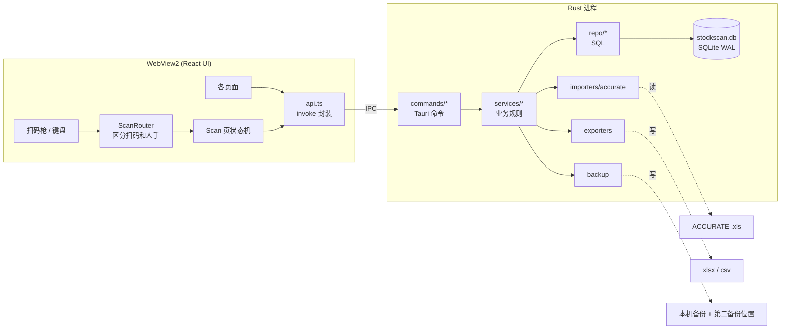
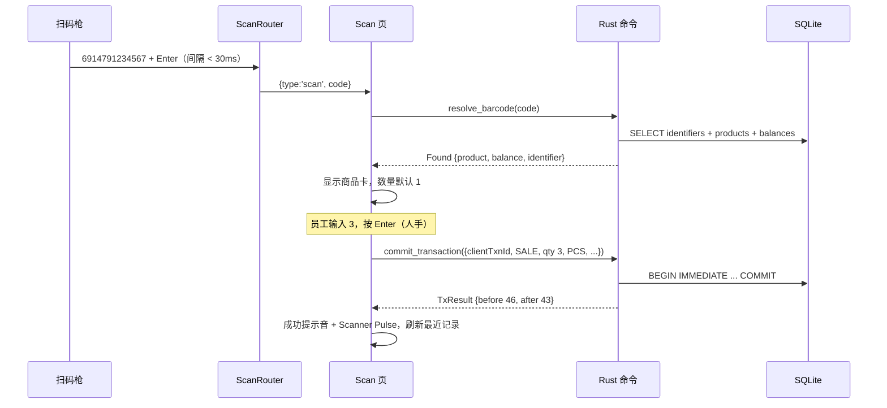
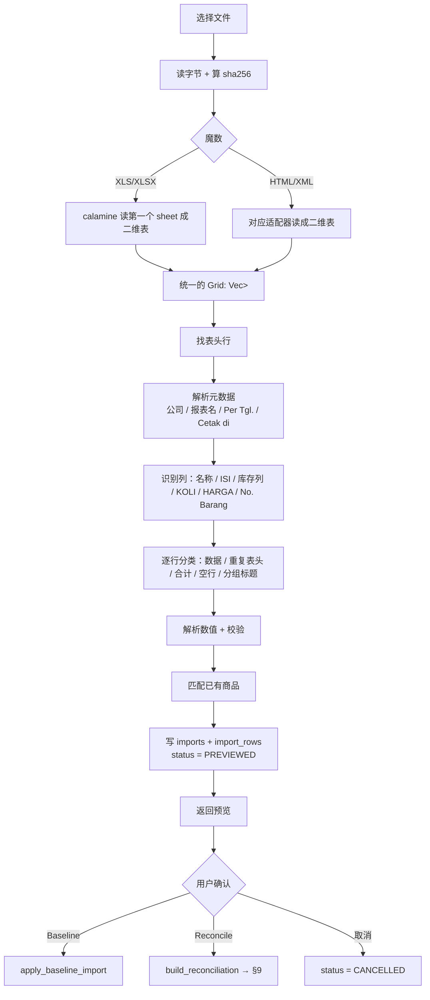

# StockScan 技术设计 v1

**对应产品文档：** `STOCKSCAN_MASTER_BLUEPRINT.md`（做什么、为什么）  
**本文档：** 怎么实现（框架、数据、接口、算法、打包、测试、实施顺序）  
**冲突时：** 产品决定以 blueprint 为准；实现细节以本文档为准。改了其中一份，要同步另一份。  
**日期：** 2026-09-10

---

# 0. 怎么读这份文档

建议顺序：

1. §1 技术选型：先认同这些决定，后面都建立在它们之上
2. §5 数据库和 §6 领域规则：这是整个系统的核心，写代码前要吃透
3. §16 实施计划：按里程碑一步步做，每步有完成标准
4. 其余章节在做到对应里程碑时再细读

约定：

- 代码、表名、字段名、命令名都用英文；说明用中文
- "必须"表示不做会出错；"建议"表示可以按实际情况调整
- 标了 **[待客户]** 的地方依赖客户回答（汇总在 §17），先按默认值实现，留好开关

---

# 1. 技术选型

| 层 | 选择 | 为什么 | 放弃的方案 |
|---|---|---|---|
| 桌面壳 | Tauri 2 | 安装包小、内存轻、不用跑本地 server | Electron（包大、内存重） |
| 前端 | React 18/19 + TypeScript + Vite | 生态成熟 | — |
| 样式 | Tailwind CSS v4 | 设计 token 直接写进 `@theme` | CSS-in-JS |
| 服务端状态 | TanStack Query | 调 Rust 命令的缓存和刷新 | 手写 useEffect |
| 客户端状态 | Zustand（很少量）+ `useReducer`（Scan 页状态机） | 简单、可测 | Redux |
| 路由 | React Router | 够用 | — |
| 大表格 | TanStack Virtual | 几千行不卡 | 分页 |
| 多语言 | i18next + react-i18next | EN / 中文 / ID | — |
| 图标 | lucide-react | 与 mock 风格一致 | — |
| **业务逻辑 + 数据库** | **Rust：rusqlite（bundled）** | 见下 | tauri-plugin-sql |
| 迁移 | rusqlite_migration | 用 `PRAGMA user_version`，简单 | 手写 |
| XLS 读取 | calamine（Rust） | 能读 legacy `.xls`（BIFF8）和 `.xlsx`；导入逻辑和数据库在同一层，方便测试 | SheetJS（npm 上的版本长期不更新，要从 cdn.sheetjs.com 装） |
| XLSX 导出 | rust_xlsxwriter | 条码能写成文本单元格 | — |
| CSV | csv crate | — | — |
| Rust↔TS 类型 | ts-rs | 从 Rust DTO 生成 TS 类型，两边不会对不上 | 手写两份 |
| 单实例 | tauri-plugin-single-instance | **必须**：防止开两个窗口同时写库 | — |
| 文件对话框 | tauri-plugin-dialog | 选导入文件、选导出位置 | — |
| 日志 | tauri-plugin-log | 客户现场出问题时要看日志 | — |
| 安装包 | NSIS，WebView2 离线安装 | 离线电脑也能装 | MSI |

### 为什么业务逻辑放 Rust，而不是在前端用 tauri-plugin-sql

blueprint §41 要求每次库存变动是一个原子事务：写流水、改余额、写异常，要么全成功要么全失败。

- tauri-plugin-sql 底层是连接池。前端分几次调用 `execute("BEGIN")`、`execute("INSERT ...")`、`execute("COMMIT")` 时，**不保证落在同一个连接上**，事务可能不生效。
- 放在 Rust 里，一个命令内部 `BEGIN IMMEDIATE ... COMMIT`，天然原子。
- Rust 端的业务函数不依赖 UI，可以用 `cargo test` + 内存 SQLite 测试所有规则。

分工原则：

```text
Rust  = 唯一能写数据库的地方；所有规则的最终裁判
React = 显示 + 输入 + 即时预览（预览只是为了快，提交时 Rust 会重新算一遍）
```

如果你对 Rust 不熟：需要写的 Rust 基本都是"读参数 → SQL → 返回结构体"，本文档给了核心函数的完整骨架（§7.5）。难点在规则，不在语言。

---

# 2. 系统架构



### 2.1 线程与连接模型

- 整个应用只有**一个** SQLite 连接，放在 `Arc<Mutex<Connection>>` 里。单机单用户，写入量很小，串行完全够用，还彻底避免了并发写的问题。
- 所有 Tauri 命令写成 `async fn`，在里面用 `tauri::async_runtime::spawn_blocking` 执行数据库操作。
  - 原因：Tauri 2 里**不带 `async` 的命令跑在主线程**，一个慢查询就会让窗口卡住。
- 导入、导出、备份这类可能要几秒的操作同样放 `spawn_blocking`，前端显示进度状态。

### 2.2 数据流：一次扫码售出



---

# 3. 仓库结构（最终版）

替换 blueprint §60 的结构。区别：导入器和迁移放在 Rust 端；多了 `bindings/`、`fixtures/`。

```text
stockscan/
├─ STOCKSCAN_MASTER_BLUEPRINT.md
├─ docs/
│  └─ TECHNICAL_DESIGN.md
├─ design/mockups/                 # 客户确认用的界面雏形（已存在）
│
├─ src/                            # React
│  ├─ main.tsx
│  ├─ app/
│  │  ├─ App.tsx                   # 路由、providers
│  │  ├─ routes.tsx
│  │  ├─ queryClient.ts
│  │  └─ guards.tsx                # 未设置 → /setup；未选员工 → /operator
│  ├─ bindings/                    # ts-rs 自动生成，不要手改（加进 .gitignore 或提交均可，见 §7.4）
│  ├─ lib/
│  │  ├─ api.ts                    # 所有 invoke 的唯一入口
│  │  ├─ errors.ts                 # AppError 类型 + 错误码 → i18n
│  │  ├─ format.ts                 # 数量、箱数、金额、时间格式化
│  │  ├─ sound.ts                  # 提示音
│  │  └─ uuid.ts
│  ├─ scanner/
│  │  ├─ ScanRouter.ts             # 扫码/人手区分（纯逻辑，可测）
│  │  ├─ ScanRouter.test.ts
│  │  └─ useScanner.ts             # 挂到 window keydown 的 hook
│  ├─ features/
│  │  ├─ scan/                     # ScanPage, scanReducer, ModeBar, ProductCard, ResultBand, UnknownPanel, RecentActivity, SessionBar
│  │  ├─ operator/                 # OperatorSelectPage
│  │  ├─ inventory/                # InventoryPage, InventoryTable, ProductDrawer
│  │  ├─ history/                  # HistoryPage
│  │  ├─ data/                     # ImportPage, ReconcilePage, ExportPages, BackupPage, DataNav
│  │  ├─ barcodes/                 # BarcodeSetupPage, BarcodeImportPage
│  │  ├─ exceptions/               # ExceptionsPanel
│  │  ├─ settings/                 # EmployeesPage, PreferencesPage
│  │  └─ setup/                    # SetupWizard
│  ├─ components/                  # Button, Kbd, Pill, Segmented, Card, Drawer, Dialog, Header, EmptyState
│  ├─ stores/
│  │  └─ operatorStore.ts
│  ├─ i18n/
│  │  ├─ index.ts
│  │  ├─ en.json
│  │  ├─ zh.json
│  │  └─ id.json
│  └─ styles/
│     └─ index.css                 # Tailwind + @theme tokens
│
├─ src-tauri/
│  ├─ Cargo.toml
│  ├─ tauri.conf.json
│  ├─ build.rs
│  ├─ .cargo/config.toml           # TS_RS_EXPORT_DIR
│  ├─ capabilities/default.json
│  ├─ migrations/
│  │  └─ 0001_init.sql
│  ├─ icons/
│  └─ src/
│     ├─ main.rs                   # 只调用 lib::run()
│     ├─ lib.rs                    # Builder、插件、命令注册、启动流程
│     ├─ state.rs                  # AppState
│     ├─ error.rs                  # AppError + 错误码
│     ├─ time.rs                   # UTC / WIB 工具
│     ├─ db/
│     │  ├─ mod.rs                 # open()、pragmas、migrate()
│     │  └─ invariants.rs          # 启动时一致性检查
│     ├─ dto/                      # 所有前后端交换的结构体（derive TS）
│     ├─ repo/                     # 纯 SQL：products.rs, identifiers.rs, balances.rs, transactions.rs, sessions.rs, ...
│     ├─ services/                 # 规则：transactions.rs, undo.rs, barcode.rs, import_baseline.rs, reconcile.rs, export.rs, backup.rs, exceptions.rs, setup.rs
│     ├─ importers/
│     │  ├─ mod.rs                 # 文件类型探测 + 统一输出 ParsedReport
│     │  ├─ accurate_stock.rs      # ACCURATE 库存报表适配器
│     │  ├─ barcode_map.rs         # 条码对应表
│     │  └─ numbers.rs             # 数字/日期解析
│     ├─ commands/                 # 薄层：参数 → spawn_blocking → service
│     └─ dev_seed.rs               # 仅 debug 构建：生成演示数据
│
├─ fixtures/
│  ├─ synthetic/                   # 自己造的、可以公开的测试报表
│  └─ private/                     # 客户真实文件，放进 .gitignore，绝不提交
│
├─ package.json
├─ vite.config.ts
├─ tsconfig.json
└─ README.md
```

**关于客户数据（必须）：** 客户的 `.xls`、价格、商品清单不要提交到 GitHub，即使仓库是私有的也不要。在 `.gitignore` 加：

```text
fixtures/private/
*.db
*.db-wal
*.db-shm
```

测试用的报表请手工做一份脱敏版放 `fixtures/synthetic/`（§15.4）。

---

# 4. 开发环境与项目初始化

## 4.1 Windows 开发机准备

1. Visual Studio Build Tools：勾选 **"Desktop development with C++"**（Rust 的 MSVC 工具链需要）
2. Rust：安装 rustup，默认工具链 `stable-x86_64-pc-windows-msvc`
3. Node.js LTS + pnpm（`npm i -g pnpm`）
4. WebView2：Windows 11 自带；Windows 10 从微软官网装 Evergreen Runtime
5. VS Code 插件：rust-analyzer、Tauri、ESLint、Tailwind CSS IntelliSense

检查：

```bash
rustc --version
```

```bash
node --version
```

## 4.2 创建项目

在仓库根目录用官方脚手架生成，然后按 §3 调整目录：

```bash
pnpm create tauri-app@latest
```

选项：项目名 `stockscan`，前端 `TypeScript / JavaScript`，包管理 `pnpm`，UI 模板 `React`，语言 `TypeScript`。脚手架会生成到子目录，把内容移到仓库根即可。

## 4.3 依赖

版本原则：**初始化时用 `cargo add` / `pnpm add` 取当时的最新稳定版，然后在 lock 文件里锁住**，不要照抄本文档里的版本号（写文档时的版本到你动手时可能已经更新）。唯一需要注意的是 `rusqlite_migration` 必须选与 `rusqlite` 版本匹配的那一版（看它的 README）。

Rust（在 `src-tauri/` 下执行）：

```bash
cargo add tauri-plugin-dialog tauri-plugin-single-instance tauri-plugin-log tauri-plugin-opener tauri-plugin-process
```

```bash
cargo add rusqlite --features bundled
```

```bash
cargo add rusqlite_migration serde --features serde/derive
```

```bash
cargo add serde_json thiserror chrono --features chrono/serde
```

```bash
cargo add calamine rust_xlsxwriter csv sha2 regex unicode-normalization log uuid --features uuid/v4
```

```bash
cargo add ts-rs --features serde-compat,chrono-impl
```

前端：

```bash
pnpm add @tauri-apps/api @tauri-apps/plugin-dialog @tauri-apps/plugin-log @tauri-apps/plugin-opener @tauri-apps/plugin-process react-router @tanstack/react-query @tanstack/react-virtual zustand i18next react-i18next lucide-react clsx @fontsource/ibm-plex-sans @fontsource/ibm-plex-mono
```

```bash
pnpm add -D tailwindcss @tailwindcss/vite vitest @testing-library/react @testing-library/user-event jsdom
```

**字体必须本地打包**（`@fontsource/*`）：客户电脑离线，Google Fonts 加载不了。中文字体不打包（Noto Sans SC 太大），用系统自带的 Microsoft YaHei 兜底。

## 4.4 `src-tauri/tauri.conf.json`（关键部分）

```json
{
  "$schema": "https://schema.tauri.app/config/2",
  "productName": "StockScan",
  "version": "0.1.0",
  "identifier": "com.stockscan.desktop",
  "build": {
    "devUrl": "http://localhost:1420",
    "frontendDist": "../dist",
    "beforeDevCommand": "pnpm dev",
    "beforeBuildCommand": "pnpm build"
  },
  "app": {
    "windows": [
      {
        "title": "StockScan",
        "width": 1440,
        "height": 900,
        "minWidth": 1280,
        "minHeight": 720,
        "maximized": true,
        "center": true
      }
    ],
    "security": {
      "csp": "default-src 'self'; img-src 'self' data:; style-src 'self' 'unsafe-inline'; font-src 'self' data:"
    }
  },
  "bundle": {
    "active": true,
    "targets": ["nsis"],
    "icon": ["icons/32x32.png", "icons/128x128.png", "icons/icon.ico"],
    "windows": {
      "webviewInstallMode": { "type": "offlineInstaller" },
      "nsis": {
        "installMode": "currentUser",
        "languages": ["English", "SimpChinese", "Indonesian"]
      }
    }
  }
}
```

说明：

- `identifier` **定了就不要改**：数据目录路径由它决定，改了等于换了一个新应用，旧数据库找不到。
- `installMode: currentUser`：装到当前用户目录，**不需要管理员权限**。客户电脑员工账号往往没有管理员权限。
- `webviewInstallMode: offlineInstaller`：安装包大约多 130MB，但离线 Windows 10 也能装（blueprint §56.1）。
- 最小窗口 1280×720：很多仓库电脑是 1366×768，布局必须在这个尺寸下可用（§12.12）。

## 4.5 `src-tauri/.cargo/config.toml`

让 ts-rs 把类型生成到前端目录：

```toml
[env]
TS_RS_EXPORT_DIR = { value = "../src/bindings", relative = true }
```

`relative = true` 表示相对 `.cargo` 所在目录（即 `src-tauri/`），所以最终输出到 `stockscan/src/bindings/`。运行 `cargo test` 时生成。

## 4.6 `package.json` scripts

```json
{
  "scripts": {
    "dev": "vite",
    "build": "tsc -b && vite build",
    "tauri": "tauri",
    "app": "tauri dev",
    "bindings": "cd src-tauri && cargo test export_bindings",
    "test": "vitest run",
    "test:rust": "cd src-tauri && cargo test",
    "release": "tauri build"
  }
}
```

日常开发：

```bash
pnpm app
```

---

# 5. 数据库设计

## 5.1 约定

| 项 | 约定 | 原因 |
|---|---|---|
| 主键 | `INTEGER PRIMARY KEY`（自增 rowid） | 单机足够；未来多机同步时再加 `public_id` |
| 时间 | `TEXT`，UTC，ISO-8601 带毫秒：`2026-09-10T08:38:12.345Z` | 字符串排序 = 时间排序；可读 |
| 日期（无时间） | `TEXT` `YYYY-MM-DD` | 报表 `Per Tgl.` 只有日期 |
| 显示时区 | 固定 `Asia/Jakarta`（WIB，UTC+7，无夏令时） | 前端用 `Intl.DateTimeFormat(..., { timeZone: 'Asia/Jakarta' })` |
| 数量 | `INTEGER`，单位永远是 **pcs** | 箱只是输入方式，不是存储单位 |
| 箱数（KOLI） | **不存**，用 `current / pack_size` 计算 | 避免第二套库存 |
| 价格 | `INTEGER`，单位 Rupiah | 印尼盾没有小数 |
| 条码 | `TEXT` | blueprint §43 |
| 布尔 | `INTEGER` 0/1 + `CHECK` | SQLite 没有布尔 |
| 枚举 | `TEXT` + `CHECK (... IN (...))` | 数据库层面挡住脏值 |
| 删除 | 业务数据不物理删除，用 `is_active` / `status` | 审计 |

## 5.2 连接与 PRAGMA

每次打开连接后执行（`db/mod.rs::open()`）：

```sql
PRAGMA foreign_keys = ON;      -- 每个连接都要开，默认是关的
PRAGMA journal_mode = WAL;
PRAGMA synchronous = FULL;     -- 写入量很小，换最高的断电安全性
PRAGMA busy_timeout = 5000;
PRAGMA temp_store = MEMORY;
```

数据库路径：`app.path().app_local_data_dir()` + `stockscan.db`，即

```text
C:\Users\<用户>\AppData\Local\com.stockscan.desktop\stockscan.db
```

用 Local 而不是 Roaming：公司域环境里 Roaming 目录可能被同步到服务器，SQLite 文件被同步会损坏。

**注意：** 数据库按 Windows 用户隔离。如果仓库电脑有多个 Windows 账号轮流登录，会各看到一份数据。部署时确认只用一个 Windows 账号 **[待客户]**。

## 5.3 完整 DDL：`src-tauri/migrations/0001_init.sql`

```sql
-- ============ 基础 ============

CREATE TABLE settings (
  key         TEXT PRIMARY KEY,
  value       TEXT NOT NULL,            -- JSON 编码的值
  updated_at  TEXT NOT NULL
);

CREATE TABLE companies (
  id          INTEGER PRIMARY KEY,
  name        TEXT NOT NULL,
  created_at  TEXT NOT NULL
);

CREATE TABLE locations (
  id            INTEGER PRIMARY KEY,
  company_id    INTEGER NOT NULL REFERENCES companies(id),
  code          TEXT NOT NULL,          -- 内部短码，如 GS8-21
  name          TEXT NOT NULL,          -- 与 ACCURATE 报表列头一致，如 'GS 8A NO 21'
  location_type TEXT NOT NULL CHECK (location_type IN ('WAREHOUSE','ONLINE','DAMAGED','OTHER')),
  external_code TEXT,                   -- 可选：GLN
  is_active     INTEGER NOT NULL DEFAULT 1 CHECK (is_active IN (0,1)),
  created_at    TEXT NOT NULL,
  updated_at    TEXT NOT NULL,
  UNIQUE (company_id, code),
  UNIQUE (company_id, name)
);

CREATE TABLE employees (
  id            INTEGER PRIMARY KEY,
  employee_code TEXT NOT NULL UNIQUE,   -- 工号，界面显示 #1024
  name          TEXT NOT NULL,
  role          TEXT NOT NULL DEFAULT 'OPERATOR' CHECK (role IN ('OPERATOR','ADMIN')),
  pin_hash      TEXT,                   -- Phase 1.5：argon2 哈希；MVP 为 NULL
  is_active     INTEGER NOT NULL DEFAULT 1 CHECK (is_active IN (0,1)),
  last_used_at  TEXT,
  created_at    TEXT NOT NULL,
  updated_at    TEXT NOT NULL
);

-- ============ 导入 ============

CREATE TABLE imports (
  id                   INTEGER PRIMARY KEY,
  import_type          TEXT NOT NULL CHECK (import_type IN ('BASELINE','RECONCILE','BARCODE_MAP','BASELINE_RESET')),
  status               TEXT NOT NULL CHECK (status IN ('PREVIEWED','APPLIED','CANCELLED','FAILED')),
  file_name            TEXT NOT NULL,
  file_sha256          TEXT NOT NULL,
  file_format          TEXT NOT NULL CHECK (file_format IN ('XLS','XLSX','HTML','SPREADSHEETML','CSV')),
  source_system        TEXT NOT NULL DEFAULT 'ACCURATE5',
  source_report_name   TEXT,            -- 'Kuantitas Barang GS 8 No.21'
  company_name         TEXT,
  source_location_name TEXT,            -- 报表里的库存列头，如 'GS 8A NO 21'
  location_id          INTEGER REFERENCES locations(id),
  report_as_of_date    TEXT,            -- YYYY-MM-DD（Per Tgl.）
  report_cutoff_at     TEXT,            -- UTC；默认 as_of 当天 23:59:59 WIB，可改
  report_printed_at    TEXT,            -- UTC（Cetak di ...）
  row_count            INTEGER NOT NULL DEFAULT 0,
  warnings_json        TEXT NOT NULL DEFAULT '[]',
  imported_by          INTEGER NOT NULL REFERENCES employees(id),
  imported_at          TEXT NOT NULL,   -- 预览创建时间
  applied_at           TEXT,
  notes                TEXT
);

-- ============ 商品与条码 ============

CREATE TABLE products (
  id                INTEGER PRIMARY KEY,
  company_id        INTEGER NOT NULL REFERENCES companies(id),
  external_code     TEXT,               -- ACCURATE 的 No. Barang（若报表提供）[待客户]
  name              TEXT NOT NULL,      -- Deskripsi Barang 原文
  name_key          TEXT NOT NULL,      -- 归一化后的名字，用于匹配（§8.7）
  model_code        TEXT,               -- 从名字里提取，如 CK-EM296，仅用于显示和搜索
  pack_size         INTEGER CHECK (pack_size IS NULL OR pack_size > 0),   -- ISI
  reference_price   INTEGER,            -- HARGA，Rupiah
  currency          TEXT NOT NULL DEFAULT 'IDR',
  is_active         INTEGER NOT NULL DEFAULT 1 CHECK (is_active IN (0,1)),
  created_import_id INTEGER REFERENCES imports(id),
  created_at        TEXT NOT NULL,
  updated_at        TEXT NOT NULL,
  UNIQUE (company_id, name_key)
);
CREATE UNIQUE INDEX ux_products_external_code
  ON products(company_id, external_code) WHERE external_code IS NOT NULL;
CREATE INDEX ix_products_model_code ON products(model_code);

CREATE TABLE identifiers (
  id              INTEGER PRIMARY KEY,
  product_id      INTEGER NOT NULL REFERENCES products(id),
  code            TEXT NOT NULL CHECK (length(code) BETWEEN 1 AND 64),
  identifier_type TEXT NOT NULL CHECK (identifier_type IN ('EAN13','EAN8','UPCA','GTIN14','CODE128','INTERNAL','OTHER')),
  unit_multiplier INTEGER NOT NULL DEFAULT 1 CHECK (unit_multiplier >= 1),  -- 箱码 > 1
  is_active       INTEGER NOT NULL DEFAULT 1 CHECK (is_active IN (0,1)),
  created_by      INTEGER REFERENCES employees(id),
  created_at      TEXT NOT NULL,
  deactivated_at  TEXT,
  deactivated_by  INTEGER REFERENCES employees(id)
);
-- 同一个条码同一时间只能指向一个商品
CREATE UNIQUE INDEX ux_identifiers_active_code ON identifiers(code) WHERE is_active = 1;
CREATE INDEX ix_identifiers_product ON identifiers(product_id);

CREATE TABLE barcode_pairing_events (
  id            INTEGER PRIMARY KEY,
  identifier_id INTEGER NOT NULL REFERENCES identifiers(id),
  product_id    INTEGER NOT NULL REFERENCES products(id),
  action        TEXT NOT NULL CHECK (action IN ('LINKED','DEACTIVATED','IMPORTED')),
  operator_id   INTEGER NOT NULL REFERENCES employees(id),
  import_id     INTEGER REFERENCES imports(id),
  created_at    TEXT NOT NULL,
  notes         TEXT
);

-- ============ 库存 ============

CREATE TABLE inventory_balances (
  location_id        INTEGER NOT NULL REFERENCES locations(id),
  product_id         INTEGER NOT NULL REFERENCES products(id),
  baseline_quantity  INTEGER NOT NULL,
  baseline_import_id INTEGER NOT NULL REFERENCES imports(id),
  current_quantity   INTEGER NOT NULL,  -- 缓存值；不变量见 §5.4
  updated_at         TEXT NOT NULL,
  PRIMARY KEY (location_id, product_id)
) WITHOUT ROWID;
-- live_delta 不存：current_quantity - baseline_quantity

-- ============ Session ============

CREATE TABLE sessions (
  id               INTEGER PRIMARY KEY,
  session_number   INTEGER NOT NULL UNIQUE,     -- 显示为 #042
  location_id      INTEGER NOT NULL REFERENCES locations(id),
  operator_id      INTEGER NOT NULL REFERENCES employees(id),
  status           TEXT NOT NULL CHECK (status IN ('OPEN','CLOSED')),
  started_at       TEXT NOT NULL,
  last_activity_at TEXT NOT NULL,
  completed_at     TEXT,
  close_reason     TEXT CHECK (close_reason IN ('FINISHED','OPERATOR_SWITCH','IDLE_TIMEOUT','APP_RESTART')),
  notes            TEXT
);
-- 单机：任何时刻最多一个 OPEN session
CREATE UNIQUE INDEX ux_sessions_single_open ON sessions(status) WHERE status = 'OPEN';

-- ============ 导出批次 ============

CREATE TABLE export_batches (
  id                  INTEGER PRIMARY KEY,
  export_type         TEXT NOT NULL CHECK (export_type IN ('TRANSACTIONS','ACCURATE_TEMPLATE')),
  status              TEXT NOT NULL CHECK (status IN ('EXPORTED','SYNCED')),
  file_name           TEXT NOT NULL,
  first_txn_id        INTEGER NOT NULL,
  last_txn_id         INTEGER NOT NULL,
  row_count           INTEGER NOT NULL,
  exported_by         INTEGER NOT NULL REFERENCES employees(id),
  exported_at         TEXT NOT NULL,
  synced_confirmed_by INTEGER REFERENCES employees(id),
  synced_at           TEXT                -- 管理员确认"已录入 ACCURATE"的时间
);

-- ============ 流水（只追加） ============

CREATE TABLE transactions (
  id                      INTEGER PRIMARY KEY,
  client_txn_id           TEXT NOT NULL UNIQUE,        -- 前端生成的 UUID，幂等
  session_id              INTEGER REFERENCES sessions(id),   -- 对账产生的调整为 NULL
  location_id             INTEGER NOT NULL REFERENCES locations(id),
  product_id              INTEGER NOT NULL REFERENCES products(id),
  identifier_id           INTEGER REFERENCES identifiers(id),
  identifier_code         TEXT,                        -- 扫到的原始码（快照）
  operation_type          TEXT NOT NULL CHECK (operation_type IN
                            ('STOCK_IN','SALE','RETURN','ADJUSTMENT','REVERSAL','RECONCILIATION_ADJUSTMENT')),
  input_quantity          INTEGER NOT NULL,            -- 员工输入的数
  input_uom               TEXT NOT NULL CHECK (input_uom IN ('PCS','CTN','COUNT','SYSTEM')),
  unit_multiplier         INTEGER NOT NULL CHECK (unit_multiplier >= 1),
  quantity_change         INTEGER NOT NULL CHECK (quantity_change <> 0),
  stock_before            INTEGER NOT NULL,
  stock_after             INTEGER NOT NULL,
  operator_id             INTEGER NOT NULL REFERENCES employees(id),
  negative_stock_warning  INTEGER NOT NULL DEFAULT 0 CHECK (negative_stock_warning IN (0,1)),
  warning_acknowledged    INTEGER NOT NULL DEFAULT 0 CHECK (warning_acknowledged IN (0,1)),
  return_disposition      TEXT CHECK (return_disposition IN ('SELLABLE','DAMAGED','QUARANTINE','OTHER')),
  reason_code             TEXT CHECK (reason_code IN ('COUNT_CORRECTION','DAMAGED','DATA_MISMATCH','OTHER')),
  reverses_transaction_id INTEGER UNIQUE REFERENCES transactions(id),   -- UNIQUE：一笔最多被撤销一次
  reconcile_import_id     INTEGER REFERENCES imports(id),
  sync_status             TEXT NOT NULL DEFAULT 'LOCAL' CHECK (sync_status IN ('LOCAL','EXPORTED','SYNCED')),
  export_batch_id         INTEGER REFERENCES export_batches(id),
  synced_at               TEXT,
  absorbed_by_import_id   INTEGER REFERENCES imports(id),  -- 已被某次对账并入 baseline
  source                  TEXT NOT NULL CHECK (source IN ('SCAN','MANUAL_CODE','PRODUCT_PANEL','SYSTEM')),
  notes                   TEXT,
  created_at              TEXT NOT NULL,

  CHECK (stock_after = stock_before + quantity_change),
  CHECK (operation_type <> 'ADJUSTMENT' OR reason_code IS NOT NULL),
  CHECK (operation_type <> 'REVERSAL'   OR reverses_transaction_id IS NOT NULL),
  CHECK (operation_type <> 'RETURN'     OR return_disposition IS NOT NULL),
  CHECK (negative_stock_warning = 0 OR warning_acknowledged = 1)
);
CREATE INDEX ix_tx_created          ON transactions(created_at);
CREATE INDEX ix_tx_product_created  ON transactions(product_id, created_at);
CREATE INDEX ix_tx_session          ON transactions(session_id);
CREATE INDEX ix_tx_sync             ON transactions(sync_status);
CREATE INDEX ix_tx_unabsorbed       ON transactions(location_id, product_id) WHERE absorbed_by_import_id IS NULL;

-- 只追加：禁止删除
CREATE TRIGGER trg_tx_no_delete BEFORE DELETE ON transactions
BEGIN
  SELECT RAISE(ABORT, 'transactions are append-only');
END;

-- 只允许改同步相关字段；其余字段一旦写入不可改
CREATE TRIGGER trg_tx_immutable BEFORE UPDATE OF
  client_txn_id, session_id, location_id, product_id, identifier_id, identifier_code,
  operation_type, input_quantity, input_uom, unit_multiplier, quantity_change,
  stock_before, stock_after, operator_id, negative_stock_warning, warning_acknowledged,
  return_disposition, reason_code, reverses_transaction_id, reconcile_import_id,
  source, notes, created_at
ON transactions
BEGIN
  SELECT RAISE(ABORT, 'transactions are immutable');
END;

-- ============ 导入明细与对账 ============

CREATE TABLE import_rows (
  id            INTEGER PRIMARY KEY,
  import_id     INTEGER NOT NULL REFERENCES imports(id),
  row_number    INTEGER NOT NULL,        -- 原文件中的行号（1 起）
  raw_name      TEXT NOT NULL,
  name_key      TEXT NOT NULL,
  external_code TEXT,
  pack_size     INTEGER,
  quantity      INTEGER,
  koli          REAL,
  price         INTEGER,
  product_id    INTEGER REFERENCES products(id),
  match_status  TEXT NOT NULL CHECK (match_status IN ('MATCHED','NEW','AMBIGUOUS','INVALID')),
  issues_json   TEXT NOT NULL DEFAULT '[]'
);
CREATE INDEX ix_import_rows_import ON import_rows(import_id);

CREATE TABLE reconciliation_lines (
  id                INTEGER PRIMARY KEY,
  import_id         INTEGER NOT NULL REFERENCES imports(id),
  product_id        INTEGER REFERENCES products(id),    -- ONLY_ACCURATE 且未建商品时为 NULL
  import_row_id     INTEGER REFERENCES import_rows(id), -- ONLY_STOCKSCAN 时为 NULL
  line_type         TEXT NOT NULL CHECK (line_type IN ('MATCHED','DIFFERENT','ONLY_STOCKSCAN','ONLY_ACCURATE')),
  prev_baseline     INTEGER,
  synced_delta      INTEGER NOT NULL DEFAULT 0,   -- 已进 ACCURATE 的 StockScan 变动
  unsynced_delta    INTEGER NOT NULL DEFAULT 0,   -- 还没进 ACCURATE 的变动
  expected          INTEGER,                      -- prev_baseline + synced_delta
  snapshot_quantity INTEGER,                      -- 新报表数
  difference        INTEGER,                      -- snapshot - expected
  decision          TEXT NOT NULL DEFAULT 'PENDING'
                    CHECK (decision IN ('PENDING','USE_ACCURATE','KEEP_STOCKSCAN','SKIP','AUTO')),
  decided_by        INTEGER REFERENCES employees(id),
  decided_at        TEXT
);
CREATE INDEX ix_recon_import ON reconciliation_lines(import_id);

-- ============ 异常 ============

CREATE TABLE exceptions (
  id              INTEGER PRIMARY KEY,
  type            TEXT NOT NULL CHECK (type IN (
                    'UNKNOWN_BARCODE','NEGATIVE_STOCK','IMPORT_DATE_WARNING','RECONCILIATION_MISMATCH',
                    'DUPLICATE_BARCODE','PACK_SIZE_MISSING','BACKUP_FAILED','SECONDARY_BACKUP_STALE')),
  severity        TEXT NOT NULL CHECK (severity IN ('INFO','WARNING','ERROR')),
  status          TEXT NOT NULL DEFAULT 'OPEN' CHECK (status IN ('OPEN','RESOLVED','DISMISSED')),
  dedup_key       TEXT,                 -- 同类问题合并用，如 'UNKNOWN_BARCODE:8997012345678'
  transaction_id  INTEGER REFERENCES transactions(id),
  product_id      INTEGER REFERENCES products(id),
  identifier_code TEXT,
  import_id       INTEGER REFERENCES imports(id),
  occurrences     INTEGER NOT NULL DEFAULT 1,
  details_json    TEXT NOT NULL DEFAULT '{}',
  first_seen_at   TEXT NOT NULL,
  last_seen_at    TEXT NOT NULL,
  resolved_at     TEXT,
  resolved_by     INTEGER REFERENCES employees(id),
  resolution_note TEXT
);
CREATE UNIQUE INDEX ux_exceptions_open_dedup ON exceptions(dedup_key) WHERE status = 'OPEN' AND dedup_key IS NOT NULL;
CREATE INDEX ix_exceptions_status ON exceptions(status);
```

### 与 blueprint §40 的差异（有意为之）

| blueprint | 本设计 | 原因 |
|---|---|---|
| `transactions.operation = BASELINE_IMPORT` | baseline 不写进流水，写在 `inventory_balances` + `imports` | baseline 是"起点"不是"变动"，写成流水会让 `quantity_change <> 0`、`stock_before` 这些约束失去意义 |
| `inventory_balances.live_delta` 列 | 不存，计算得出 | 少一个可能不一致的字段 |
| `sessions.operation_type` | 删除 | blueprint §18.1 |
| 无 | `absorbed_by_import_id`、`reconciliation_lines`、`import_rows` | 支撑 §9 对账 |
| 无 | 两个 trigger | 数据库层保证流水只追加、不可改 |
| `exceptions` | 加 `dedup_key`、`occurrences` | 同一个未知条码扫 10 次只算一条异常 |

## 5.4 不变量（必须一直成立）

这些是整个系统正确性的底线。启动时（`db/invariants.rs`）和每次导入 / 对账 / 恢复之后各检查一次；不成立就写日志并在界面顶部显示红色错误，**不要自动修复**。

**I1 余额 = 基线 + 未并入的流水**

```sql
SELECT b.location_id, b.product_id, b.current_quantity,
       b.baseline_quantity + COALESCE(SUM(t.quantity_change), 0) AS expected
FROM inventory_balances b
LEFT JOIN transactions t
  ON t.location_id = b.location_id
 AND t.product_id  = b.product_id
 AND t.absorbed_by_import_id IS NULL
GROUP BY b.location_id, b.product_id
HAVING b.current_quantity <> expected;
-- 结果必须为空
```

**I2 每笔流水的 before/after 连续**：同一 location+product 下按 id 排序，后一笔的 `stock_before` 等于前一笔的 `stock_after`（对账 apply 那一刻除外，因为基线跳变；对账产生的 `RECONCILIATION_ADJUSTMENT` 的 before 等于跳变后的值）。这条只在测试里检查，不在启动时跑。

**I3 REVERSAL 金额相反**

```sql
SELECT r.id FROM transactions r
JOIN transactions o ON o.id = r.reverses_transaction_id
WHERE r.quantity_change <> -o.quantity_change;
-- 结果必须为空
```

**I4 同步状态一致**

```sql
SELECT id FROM transactions
WHERE (sync_status = 'LOCAL'    AND export_batch_id IS NOT NULL)
   OR (sync_status <> 'LOCAL'   AND export_batch_id IS NULL)
   OR (sync_status = 'SYNCED'   AND synced_at IS NULL);
-- 结果必须为空
```

**I5 最多一个 OPEN session**：由唯一索引保证。

## 5.5 常用查询与索引覆盖

| 查询 | 用到的索引 |
|---|---|
| 扫码查商品：`identifiers WHERE code=? AND is_active=1` | `ux_identifiers_active_code` |
| 库存列表：`products JOIN inventory_balances LEFT JOIN identifiers` | 主键 + `ix_identifiers_product` |
| 某商品历史 | `ix_tx_product_created` |
| 本 session 最近记录 | `ix_tx_session` |
| 待导出流水：`sync_status='LOCAL'` | `ix_tx_sync` |
| 对账算未并入变动 | `ix_tx_unabsorbed` |

目标：1 万个商品、10 万条流水以内，所有查询 < 50ms。不需要做进一步优化。

## 5.6 settings 键

值一律存 JSON。用 Rust 里的强类型 `Settings` 结构体读写，不要在各处散落字符串。

| key | 类型 | 默认 | 说明 |
|---|---|---|---|
| `company_id` | int | — | 设置向导写入 |
| `active_location_id` | int | — | 当前仓库 |
| `language` | `"en"\|"zh"\|"id"` | `"en"` | 界面语言 |
| `setup_completed_at` | string\|null | null | 为 null 时启动进入向导 |
| `scanner.max_gap_ms` | int | 35 | §12.5 |
| `scanner.min_length` | int | 6 | |
| `scanner.idle_flush_ms` | int | 60 | |
| `scanner.suffix` | `"Enter"\|"Tab"\|"None"` | `"Enter"` | 向导里扫码测试自动识别 |
| `scanner.dedup_ms` | int | 300 | |
| `scan.quick_scan_enabled` | bool | false | |
| `scan.fkeys_enabled` | bool | true | F1–F4 |
| `scan.auto_commit_on_next_scan` | bool | false | §6.9，**[待客户]**试用后决定 |
| `session.idle_minutes` | int | 30 | |
| `sound.enabled` | bool | true | |
| `backup.secondary_dir` | string\|null | null | 第二备份位置 |
| `backup.last_success_at` | string\|null | null | |
| `backup.last_secondary_success_at` | string\|null | null | |
| `backup.stale_warning_days` | int | 2 | |
| `import.missing_rows_mean_zero` | bool | false | 新报表里没有的商品是否视为 0 **[待客户]** |
| `session.next_number` | int | 1 | 下一个 session 号 |

---

# 6. 领域规则（精确定义）

这一节是 Rust `services/` 的规格说明。每一条都应该有对应的单元测试（§15.2）。

## 6.1 四种操作的数量换算

记号：`q` = 员工输入的数量，`m` = 单位倍数，`cur` = 当前库存。

| 操作 | 输入 | `input_uom` | `m` 取值 | `quantity_change` | 额外必填 |
|---|---|---|---|---|---|
| STOCK_IN | q ≥ 1 | PCS / CTN | 见下 | `+q × m` | — |
| SALE | q ≥ 1 | PCS / CTN | 见下 | `−q × m` | — |
| RETURN | q ≥ 1 | PCS / CTN | 见下 | `+q × m` | `return_disposition`（MVP 固定 `SELLABLE`） |
| ADJUSTMENT | 实际数到的数 c ≥ 0 | COUNT | 1 | `c − cur` | `reason_code` |
| REVERSAL | 系统生成 | SYSTEM | 1 | `−原交易.quantity_change` | `reverses_transaction_id` |
| RECONCILIATION_ADJUSTMENT | 系统生成 | SYSTEM | 1 | 见 §9 | `reconcile_import_id` |

`m` 的取值：

```text
扫的是单件码（identifier.unit_multiplier = 1）：
    PCS → m = 1
    CTN → m = product.pack_size（ISI）；pack_size 为空 → 错误 PACK_SIZE_MISSING
扫的是箱码（identifier.unit_multiplier > 1）：
    只允许 PCS，m = identifier.unit_multiplier
    前端自动锁定为"箱码"显示；请求里如果带 CTN → 错误 CARTON_BARCODE_WITH_CTN（blueprint §15.1）
手动从商品面板操作（没有 identifier）：同单件码
```

`quantity_change = 0` 的 ADJUSTMENT（数到的和系统一样）：**不写流水**，返回 `NO_CHANGE`，前端提示"数量一致，无需调整"。

## 6.2 输入限制

| 字段 | 规则 | 错误码 |
|---|---|---|
| `input_quantity`（非 ADJUSTMENT） | 1 ≤ q ≤ 999,999 | `INVALID_QUANTITY` |
| ADJUSTMENT 的 c | 0 ≤ c ≤ 9,999,999 | `INVALID_QUANTITY` |
| `q × m` | ≤ 9,999,999，用 `checked_mul` | `QUANTITY_TOO_LARGE` |
| 条码 | trim 后 1–64 个字符；去掉 CR/LF；不做任何数字转换 | `INVALID_CODE` |
| `client_txn_id` | UUID 格式 | `INVALID_INPUT` |

## 6.3 负库存

- 只有 `quantity_change < 0` 且 `stock_after < 0` 时触发（ADJUSTMENT 不会触发，因为 c ≥ 0）
- 请求没有 `acknowledge_negative = true` → 返回 `NEEDS_ACK`（带 before / after），**不写库**
- 前端显示黄色警告条（mock 第 4 屏），员工按"继续"后带上 `acknowledge_negative = true` 重发同一个 `client_txn_id`
- 写库时 `negative_stock_warning = 1, warning_acknowledged = 1`，同时建一条 `NEGATIVE_STOCK` 异常
- 当前库存已经是负数、再卖：同样警告，每次都警告

## 6.4 Session 生命周期

```text
            第一次 commit 成功（且没有 OPEN session）
   (无) ─────────────────────────────────────────────▶ OPEN
                                                        │
   OPEN ── 点 Finish Session ─────────────────────────▶ CLOSED (FINISHED)
   OPEN ── 切换员工 ──────────────────────────────────▶ CLOSED (OPERATOR_SWITCH)
   OPEN ── 下次 commit 时发现 now − last_activity > idle_minutes ─▶ CLOSED (IDLE_TIMEOUT)，然后开新 session
   OPEN ── 应用启动时发现有遗留 OPEN session ──────────▶ CLOSED (APP_RESTART)
```

规则：

- **扫码不开 session，提交才开**。只扫不提交不留痕迹（未知条码异常除外）
- session 号：从 `settings.session.next_number` 取，同一事务内 +1
- 每次 commit 更新 `last_activity_at`
- Session 汇总按 operation_type 分组：`SELECT operation_type, COUNT(*), SUM(quantity_change) ... GROUP BY operation_type`

## 6.5 Undo（撤销）

允许撤销的交易必须**同时**满足：

1. 属于当前 OPEN session
2. `operator_id` = 当前员工
3. 类型是 STOCK_IN / SALE / RETURN / ADJUSTMENT（REVERSAL 和对账调整不能撤销）
4. 还没被撤销过（不存在 `reverses_transaction_id = 它` 的流水）
5. 是该 session 里满足 1–4 的**最新一笔**（按 id 倒序逐笔撤）

撤销 = 插入一笔 REVERSAL：

```text
quantity_change = −original.quantity_change
stock_before    = 当前 current_quantity（不是原交易的 after，中间可能有别的交易）
stock_after     = stock_before + quantity_change
input_quantity  = original.input_quantity，input_uom = SYSTEM，unit_multiplier = 1
```

- 撤销后变成负数：允许，自动 `warning_acknowledged = 1`，建 NEGATIVE_STOCK 异常
- 原交易已经 EXPORTED / SYNCED：允许撤销，返回结果里带 `wasExported: true`，前端提示"这笔已导出，下次导出会带上这笔撤销"
- 没有可撤销的交易 → `NOTHING_TO_UNDO`

## 6.6 同步状态机

```text
LOCAL ──（导出交易，生成 export_batch）──▶ EXPORTED ──（管理员确认该批次已录入 ACCURATE）──▶ SYNCED
```

- "导出交易"默认导出所有 `LOCAL` 的流水，一次导出 = 一个批次
- 同一批次可以重新生成文件（丢了文件时），不改变状态
- 标记 SYNCED 是按**批次**操作，管理员填"录入 ACCURATE 的日期时间"（默认现在），写到批次和该批次所有流水的 `synced_at`
- 状态只能前进，不能后退。录错了用新流水更正，不改旧流水
- 对账只看 SYNCED（§9）

## 6.7 条码规则

**查码**（`resolve_barcode`）：

```text
code = trim(code)，去掉 \r \n
在 identifiers 里查 code = ? AND is_active = 1
  0 行 → Unknown：记 UNKNOWN_BARCODE 异常（dedup_key = 'UNKNOWN_BARCODE:' || code，已存在则 occurrences + 1）
  1 行 → Found，但商品 is_active = 0 → ProductInactive
不做模糊匹配，不去前导零，不猜
```

**绑定**（`link_barcode`）：

- 该码已绑定到**同一商品** → 幂等成功
- 已绑定到**别的商品** → `BARCODE_IN_USE`，返回占用它的商品名。要换绑必须先解绑（管理员操作）
- 自动识别类型：

```text
13 位纯数字且校验位正确 → EAN13
 8 位纯数字且校验位正确 → EAN8
12 位纯数字且校验位正确 → UPCA
14 位纯数字且校验位正确 → GTIN14
其他 → CODE128（含字母）或 OTHER
纯数字但校验位错误 → OTHER，并在界面提示"校验位不对，可能扫错了，确认要绑定吗"
```

GS1 校验位算法（EAN-8/12/13/14 通用）：从右往左数，不含校验位，奇数位 ×3、偶数位 ×1，求和 s，校验位 = (10 − s mod 10) mod 10。

- `unit_multiplier`：界面二选一"单件 / 整箱"；整箱时 = 商品 ISI（没有 ISI 时让管理员手填）
- 每次绑定 / 解绑写 `barcode_pairing_events`

## 6.8 什么时候创建异常

| 类型 | 触发点 | severity | dedup_key |
|---|---|---|---|
| UNKNOWN_BARCODE | resolve 找不到 | WARNING | `UNKNOWN_BARCODE:<code>` |
| NEGATIVE_STOCK | commit / undo 后为负 | WARNING | 无（每笔一条） |
| IMPORT_DATE_WARNING | 报表日期晚于导入时间，或早于上一次导入 | WARNING | `IMPORT_DATE:<import_id>` |
| RECONCILIATION_MISMATCH | 对账 apply 时每个 DIFFERENT 行 | INFO | 无 |
| DUPLICATE_BARCODE | 条码对应表导入时同码指向不同商品 | ERROR | `DUP_BARCODE:<code>` |
| PACK_SIZE_MISSING | 导入时 ISI 缺失 / 0 | INFO | `PACK_SIZE:<product_id>` |
| BACKUP_FAILED | 自动备份失败 | ERROR | `BACKUP_FAILED` |
| SECONDARY_BACKUP_STALE | 第二位置超过 N 天没成功写入 | WARNING | `SECONDARY_STALE` |

异常处理（resolve / dismiss）需要填备注。未知条码异常可以直接从异常面板点"去绑定"跳到 Barcode Setup，绑定成功后自动 resolve。

## 6.9 商品卡未确认时又扫了新码

blueprint §42.2 第 3 条。默认（`scan.auto_commit_on_next_scan = false`）：

```text
前一张卡片丢弃，不写库
播放 warning 音
顶部提示 3 秒："上一件未确认：CK-EM296 × 3"（点它可以恢复那张卡片）
显示新商品卡
```

开关打开时：前一张卡按当前数量直接提交，再显示新卡。负库存警告的卡片不会被自动提交（必须人工确认）。

## 6.10 箱数显示

```text
splitCartons(q, isi):
  isi 为空或 ≤ 0 → 不显示箱数
  q < 0         → 不显示箱数（显示"低于 0"）
  否则 ctn = floor(q / isi), pcs = q mod isi
  显示：pcs = 0 → "11 ctn"；否则 "11 ctn + 42 pcs"
  （印尼语 "11 koli + 42 pcs"，中文 "11 箱 + 42 件"）

cartonEquivalent(q, isi) = round(q / isi, 2)   -- 仅 Inventory 表格和导出，与 ACCURATE 的 KOLI 对应
```

---

# 7. Rust 后端

## 7.1 分层

```text
commands/   薄层。只做：取 State → spawn_blocking → 调 service → 返回 DTO。不写 SQL，不写规则。
services/   规则。接收 &mut Connection（或 &Transaction）和 now: DateTime<Utc>，返回 Result<Dto, AppError>。
            不依赖 Tauri，方便 cargo test。时间从参数传入，测试可以固定时间。
repo/       纯 SQL。每个函数一条或几条语句，接收 &Connection（Transaction 可以 deref 成 Connection）。
dto/        所有前后端交换的结构体，derive(Serialize, Deserialize, TS)。
```

规则：**service 之间可以互相调用，command 之间不可以**。任何写操作都从一个 service 函数开始、在同一个 SQLite 事务里结束。

## 7.2 AppState 与启动流程

```rust
// src-tauri/src/state.rs
use std::sync::{Arc, Mutex};
use std::path::PathBuf;
use rusqlite::Connection;

pub struct AppState {
    pub db: Arc<Mutex<Connection>>,
    pub paths: AppPaths,
}

#[derive(Clone)]
pub struct AppPaths {
    pub data_dir: PathBuf,     // app_local_data_dir
    pub db_file: PathBuf,      // data_dir/stockscan.db
    pub backup_dir: PathBuf,   // data_dir/backups
    pub export_dir: PathBuf,   // 默认导出目录：Documents/StockScan
    pub log_dir: PathBuf,
}
```

```rust
// src-tauri/src/lib.rs（结构示意）
pub fn run() {
    tauri::Builder::default()
        // 必须第一个注册：第二次启动时把已有窗口拉到前面，然后退出新进程
        .plugin(tauri_plugin_single_instance::init(|app, _args, _cwd| {
            if let Some(w) = app.get_webview_window("main") {
                let _ = w.unminimize();
                let _ = w.set_focus();
            }
        }))
        .plugin(tauri_plugin_log::Builder::new()
            .level(log::LevelFilter::Info)
            .max_file_size(5_000_000)
            .build())
        .plugin(tauri_plugin_dialog::init())
        .plugin(tauri_plugin_opener::init())
        .plugin(tauri_plugin_process::init())      // 恢复备份后 relaunch
        .setup(|app| {
            let paths = paths::resolve(app.handle())?;          // 建目录
            let mut conn = db::open(&paths.db_file)?;           // PRAGMA
            db::migrate(&mut conn)?;                            // 迁移前如果库非空，先做一次 pre-migration 备份
            services::sessions::close_stale_on_startup(&mut conn, Utc::now())?;
            let report = db::invariants::check(&conn)?;         // 结果存起来，前端启动时读取
            services::backup::daily_if_needed(&mut conn, &paths, Utc::now());  // 失败不阻止启动，只记异常
            app.manage(AppState { db: Arc::new(Mutex::new(conn)), paths });
            app.manage(StartupReport(report));
            Ok(())
        })
        .invoke_handler(tauri::generate_handler![
            // 全部命令见 §7.4
        ])
        .run(tauri::generate_context!())
        .expect("error while running StockScan");
}
```

命令的统一写法：

```rust
// src-tauri/src/commands/transactions.rs
#[tauri::command]
pub async fn commit_transaction(
    state: tauri::State<'_, AppState>,
    input: CommitTxInput,
) -> Result<TxResult, AppError> {
    let db = state.db.clone();
    tauri::async_runtime::spawn_blocking(move || {
        let mut conn = db.lock().map_err(|_| AppError::internal("db lock poisoned"))?;
        services::transactions::commit(&mut conn, &input, chrono::Utc::now())
    })
    .await
    .map_err(|e| AppError::internal(e.to_string()))?
}
```

每个命令都照这个模板写。可以写一个小宏或辅助函数 `with_db(state, |conn| ...)` 减少重复。

## 7.3 错误模型

前端收到的错误永远是这个形状：

```ts
interface AppError {
  code: string;               // 稳定的错误码，前端据此翻译和分支
  message: string;            // 英文开发者信息，写日志用，不直接给员工看
  details?: Record<string, unknown>;
}
```

```rust
// src-tauri/src/error.rs
use serde::ser::{Serialize, SerializeStruct, Serializer};
use serde_json::{json, Value};

#[derive(Debug, thiserror::Error)]
pub enum AppError {
    #[error("invalid input: {0}")]            InvalidInput(String),
    #[error("invalid quantity")]              InvalidQuantity,
    #[error("quantity too large")]            QuantityTooLarge,
    #[error("no change")]                     NoChange,
    #[error("needs acknowledgement")]         NeedsAck { stock_before: i64, stock_after: i64 },
    #[error("pack size missing")]             PackSizeMissing { product_id: i64 },
    #[error("carton barcode with CTN")]       CartonBarcodeWithCtn,
    #[error("barcode in use")]                BarcodeInUse { product_id: i64, product_name: String },
    #[error("not found: {0}")]                NotFound(&'static str),
    #[error("operator inactive")]             OperatorInactive,
    #[error("setup incomplete")]              SetupIncomplete,
    #[error("nothing to undo")]               NothingToUndo,
    #[error("baseline exists")]               BaselineExists,
    #[error("import: {0}")]                   Import(ImportIssue),
    #[error("reconcile has pending lines")]   ReconcilePending { pending: i64 },
    #[error("preview expired")]               PreviewStale,
    #[error("backup: {0}")]                   Backup(String),
    #[error("database: {0}")]                 Db(#[from] rusqlite::Error),
    #[error("io: {0}")]                       Io(#[from] std::io::Error),
    #[error("internal: {0}")]                 Internal(String),
}

impl AppError {
    pub fn internal(s: impl Into<String>) -> Self { Self::Internal(s.into()) }

    pub fn code(&self) -> &'static str {
        match self {
            Self::InvalidInput(_) => "INVALID_INPUT",
            Self::InvalidQuantity => "INVALID_QUANTITY",
            Self::QuantityTooLarge => "QUANTITY_TOO_LARGE",
            Self::NoChange => "NO_CHANGE",
            Self::NeedsAck { .. } => "NEEDS_ACK",
            Self::PackSizeMissing { .. } => "PACK_SIZE_MISSING",
            Self::CartonBarcodeWithCtn => "CARTON_BARCODE_WITH_CTN",
            Self::BarcodeInUse { .. } => "BARCODE_IN_USE",
            Self::NotFound(_) => "NOT_FOUND",
            Self::OperatorInactive => "OPERATOR_INACTIVE",
            Self::SetupIncomplete => "SETUP_INCOMPLETE",
            Self::NothingToUndo => "NOTHING_TO_UNDO",
            Self::BaselineExists => "BASELINE_EXISTS",
            Self::Import(_) => "IMPORT_ERROR",
            Self::ReconcilePending { .. } => "RECONCILE_PENDING",
            Self::PreviewStale => "PREVIEW_STALE",
            Self::Backup(_) => "BACKUP_ERROR",
            Self::Db(_) => "DB_ERROR",
            Self::Io(_) => "IO_ERROR",
            Self::Internal(_) => "INTERNAL",
        }
    }

    fn details(&self) -> Value {
        match self {
            Self::NeedsAck { stock_before, stock_after } => json!({ "stockBefore": stock_before, "stockAfter": stock_after }),
            Self::PackSizeMissing { product_id } => json!({ "productId": product_id }),
            Self::BarcodeInUse { product_id, product_name } => json!({ "productId": product_id, "productName": product_name }),
            Self::ReconcilePending { pending } => json!({ "pending": pending }),
            Self::NotFound(what) => json!({ "entity": what }),
            Self::Import(issue) => serde_json::to_value(issue).unwrap_or(Value::Null),
            _ => Value::Null,
        }
    }
}

impl Serialize for AppError {
    fn serialize<S: Serializer>(&self, s: S) -> Result<S::Ok, S::Error> {
        let mut st = s.serialize_struct("AppError", 3)?;
        st.serialize_field("code", self.code())?;
        st.serialize_field("message", &self.to_string())?;
        st.serialize_field("details", &self.details())?;
        st.end()
    }
}
```

- `Db`、`Io`、`Internal` 在前端统一显示"系统错误，请联系管理员"，并写日志（带完整 message）
- 其他错误码都要有三种语言的员工可读文案（`errors.<CODE>`）
- 完整错误码表见附录 A

## 7.4 命令清单与 DTO

DTO 约定：

```rust
#[derive(Debug, Clone, Serialize, Deserialize, TS)]
#[serde(rename_all = "camelCase")]
#[ts(export)]
pub struct Example {
    #[ts(type = "number")]   // i64 在 ts-rs 里默认是 bigint，但 JSON 里是 number，必须标注
    pub id: i64,
}

#[derive(Debug, Clone, Copy, Serialize, Deserialize, TS, PartialEq, Eq)]
#[serde(rename_all = "SCREAMING_SNAKE_CASE")]
#[ts(export)]
pub enum OperationType { StockIn, Sale, Return, Adjustment, Reversal, ReconciliationAdjustment }
```

每个 DTO 文件末尾加一个导出测试，`pnpm bindings` 就会生成 TS：

```rust
#[cfg(test)]
mod export_bindings {
    #[test]
    fn export_bindings() { /* ts-rs 的 #[ts(export)] 会在 cargo test 时自动写文件，这里留空即可 */ }
}
```

`src/bindings/` 建议**提交到 git**：这样只改前端的人不用装 Rust 也能编译。CI（以后有的话）检查生成结果与提交一致。

下面 TS 形式列出（Rust 对应结构体同名、字段 snake_case）。

### 应用与设置

| 命令 | 输入 | 输出 | 说明 |
|---|---|---|---|
| `get_startup_state` | — | `StartupState` | 是否已完成设置、不变量检查结果、上次备份时间、数据目录 |
| `get_settings` | — | `Settings` | |
| `update_settings` | `Partial<Settings>` | `Settings` | 管理员 |
| `complete_setup` | `SetupInput` | `StartupState` | 向导最后一步（§13） |

```ts
interface StartupState {
  setupCompleted: boolean;
  invariantViolations: number;          // > 0 时顶部红条
  lastBackupAt: string | null;
  secondaryBackupStale: boolean;
  activeLocation: LocationDto | null;
  companyName: string | null;
  dataDir: string;
  appVersion: string;
}
```

### 员工与 Session

| 命令 | 输入 | 输出 |
|---|---|---|
| `list_employees` | `{ includeInactive?: boolean }` | `EmployeeDto[]` |
| `upsert_employee` | `EmployeeInput` | `EmployeeDto` |
| `set_employee_active` | `{ id, active }` | `EmployeeDto` |
| `select_operator` | `{ employeeId }` | `OperatorContext` | 关闭别人留下的 OPEN session（OPERATOR_SWITCH），更新 `last_used_at` |
| `get_current_session` | `{ operatorId }` | `SessionSummary \| null` |
| `finish_session` | `{ operatorId }` | `SessionSummary \| null` |

```ts
interface EmployeeDto { id: number; employeeCode: string; name: string; role: 'OPERATOR' | 'ADMIN'; isActive: boolean; lastUsedAt: string | null; }

interface SessionSummary {
  id: number; sessionNumber: number; operatorId: number; operatorName: string;
  startedAt: string; lastActivityAt: string;
  txCount: number; productCount: number; totalUnits: number;   // totalUnits = Σ|quantity_change|
  netChange: number;
  byOperation: { operation: OperationType; count: number; netChange: number }[];
}
```

### 扫码与交易

| 命令 | 输入 | 输出 |
|---|---|---|
| `resolve_barcode` | `{ code: string }` | `ResolveResult` |
| `get_product_card` | `{ productId }` | `ProductCard` | 从商品面板手动操作时用 |
| `commit_transaction` | `CommitTxInput` | `TxResult` |
| `undo_last` | `{ operatorId, clientTxnId }` | `TxResult & { wasExported: boolean }` |

```ts
type ResolveResult =
  | { kind: 'FOUND'; card: ProductCard; identifier: IdentifierDto }
  | { kind: 'UNKNOWN'; code: string }
  | { kind: 'PRODUCT_INACTIVE'; code: string; productName: string };

interface ProductCard {
  productId: number; name: string; modelCode: string | null;
  packSize: number | null; referencePrice: number | null;
  locationId: number;
  baselineQuantity: number; currentQuantity: number;   // liveDelta 前端算
  baselineAsOf: string | null;                          // 报表日期
}

interface IdentifierDto { id: number; code: string; identifierType: IdentifierType; unitMultiplier: number; }

interface CommitTxInput {
  clientTxnId: string;               // crypto.randomUUID()，商品卡出现时生成，重试时不变
  operatorId: number;
  productId: number;
  identifierCode: string | null;     // 手动操作时为 null
  operation: 'STOCK_IN' | 'SALE' | 'RETURN' | 'ADJUSTMENT';
  inputQuantity: number;
  inputUom: 'PCS' | 'CTN' | 'COUNT';
  reasonCode?: ReasonCode;           // ADJUSTMENT 必填
  returnDisposition?: ReturnDisposition;  // RETURN；MVP 前端固定 'SELLABLE'
  acknowledgeNegative: boolean;
  source: 'SCAN' | 'MANUAL_CODE' | 'PRODUCT_PANEL';
  notes?: string;
}

interface TxResult {
  transactionId: number; clientTxnId: string;
  operation: OperationType; quantityChange: number;
  stockBefore: number; stockAfter: number;
  negativeWarning: boolean;
  session: SessionSummary;
  createdAt: string;
  idempotentReplay: boolean;         // true = 这个 clientTxnId 之前已经成功过，这次只是返回原结果
}
```

### 库存、历史、异常

| 命令 | 输入 | 输出 | 说明 |
|---|---|---|---|
| `list_inventory` | — | `InventoryRow[]` | **一次返回全部**，前端过滤 / 搜索 / 排序（1 万行以内完全没问题） |
| `get_product_detail` | `{ productId }` | `ProductDetail` | 右侧抽屉 |
| `list_transactions` | `TxQuery` | `{ rows: TxRow[]; nextCursor: number \| null }` | 服务端分页，每页 100 |
| `list_exceptions` | `{ status?: 'OPEN' \| 'ALL' }` | `ExceptionDto[]` | |
| `count_open_exceptions` | — | `number` | 顶部角标 |
| `resolve_exception` | `{ id, status: 'RESOLVED' \| 'DISMISSED', note, operatorId }` | `ExceptionDto` | |

```ts
interface InventoryRow {
  productId: number; name: string; modelCode: string | null; externalCode: string | null;
  packSize: number | null; referencePrice: number | null;
  baselineQuantity: number; currentQuantity: number;
  barcodeCount: number;             // 0 = Unlinked
  lastChangedAt: string | null;     // 最近一笔流水时间
  openExceptionCount: number;
}

interface TxQuery {
  from?: string; to?: string;          // UTC ISO
  operatorId?: number; operation?: OperationType; sessionId?: number; productId?: number;
  search?: string;                     // 商品名 / 型号 / 条码
  cursor?: number;                     // 上一页最后一个 id
  limit?: number;                      // 默认 100，最大 500
}

interface TxRow {
  id: number; createdAt: string;
  operatorId: number; operatorName: string; operatorCode: string;
  productId: number; productName: string; modelCode: string | null;
  identifierCode: string | null;
  operation: OperationType; inputQuantity: number; inputUom: InputUom; unitMultiplier: number;
  quantityChange: number; stockBefore: number; stockAfter: number;
  sessionNumber: number | null;
  negativeWarning: boolean; reasonCode: ReasonCode | null;
  reversesTransactionId: number | null; reversedByTransactionId: number | null;
  syncStatus: 'LOCAL' | 'EXPORTED' | 'SYNCED';
}
```

### 条码

| 命令 | 输入 | 输出 |
|---|---|---|
| `get_barcode_coverage` | — | `{ products: number; linked: number; unlinked: number }` |
| `next_unlinked_product` | `{ afterProductId?: number }` | `ProductCard \| null` |
| `check_barcode` | `{ code }` | `{ available: boolean; detectedType: IdentifierType; checkDigitValid: boolean \| null; usedBy?: { productId; name } }` |
| `link_barcode` | `{ productId, code, kind: 'UNIT' \| 'CARTON', unitMultiplier?: number, operatorId }` | `IdentifierDto` |
| `deactivate_barcode` | `{ identifierId, operatorId, note }` | `void` |
| `list_recent_links` | `{ limit }` | `RecentLink[]` |
| `export_barcode_template` | `{ path, onlyUnlinked: boolean }` | `{ rowCount }` |
| `preview_barcode_import` | `{ path, operatorId }` | `BarcodeImportPreview` |
| `apply_barcode_import` | `{ importId, operatorId }` | `{ linked; skipped; conflicts }` |

### 导入、对账、导出、备份

| 命令 | 输入 | 输出 |
|---|---|---|
| `preview_stock_report` | `{ path, operatorId, purpose: 'BASELINE' \| 'RECONCILE' }` | `StockReportPreview`（§8.8） |
| `set_report_options` | `{ importId, stockColumn?, cutoffAt? }` | `StockReportPreview` |
| `apply_baseline_import` | `{ importId, operatorId }` | `{ products; balances }` |
| `build_reconciliation` | `{ importId, operatorId }` | `ReconcileView`（§9.5） |
| `set_reconcile_decision` | `{ lineIds: number[], decision, operatorId }` | `ReconcileView` |
| `apply_reconciliation` | `{ importId, operatorId }` | `ReconcileApplyResult` |
| `cancel_import` | `{ importId }` | `void` |
| `export_current_stock` | `{ path, format: 'XLSX' \| 'CSV' }` | `{ rowCount; path }` |
| `export_transactions` | `{ path, format, operatorId }` | `ExportBatchDto` |
| `regenerate_export` | `{ batchId, path, format }` | `{ path }` |
| `list_export_batches` | — | `ExportBatchDto[]` |
| `mark_batch_synced` | `{ batchId, syncedAt, operatorId }` | `ExportBatchDto` |
| `backup_now` | `{ reason: 'MANUAL' }` | `BackupResult` |
| `list_backups` | — | `BackupFile[]` |
| `set_secondary_backup_dir` | `{ path \| null }` | `BackupResult \| null` | 设置后立刻试写一次 |
| `restore_backup` | `{ path, operatorId }` | `void` | 成功后前端调用 `relaunch` |

### 仅开发构建

| 命令 | 说明 |
|---|---|
| `dev_seed_demo` | `#[cfg(debug_assertions)]`：造 1 个公司、1 个仓库、3 个员工、2,000 个商品、1,500 个条码、baseline |
| `dev_reset_db` | 删库重建 |

## 7.5 核心：`services::transactions::commit`

这是整个系统最重要的函数，对应 blueprint §41。下面是完整骨架，repo 函数名自己实现。

```rust
use chrono::{DateTime, Utc};
use rusqlite::{Connection, OptionalExtension, TransactionBehavior, params};

const MAX_INPUT: i64 = 999_999;
const MAX_COUNT: i64 = 9_999_999;

pub fn commit(conn: &mut Connection, input: &CommitTxInput, now: DateTime<Utc>) -> Result<TxResult, AppError> {
    // 0. 幂等：同一个 clientTxnId 已经成功过 → 原样返回（前端网络重试、双击都安全）
    if let Some(existing) = repo::transactions::find_result_by_client_id(conn, &input.client_txn_id)? {
        return Ok(TxResult { idempotent_replay: true, ..existing });
    }
    validate(input)?;

    // IMMEDIATE：一开始就拿写锁，避免"读完再升级写锁"失败
    let tx = conn.transaction_with_behavior(TransactionBehavior::Immediate)?;

    // 1. 员工
    let operator = repo::employees::get(&tx, input.operator_id)?.ok_or(AppError::NotFound("employee"))?;
    if !operator.is_active { return Err(AppError::OperatorInactive); }

    // 2. 当前仓库
    let settings = repo::settings::load(&tx)?;
    let location_id = settings.active_location_id.ok_or(AppError::SetupIncomplete)?;

    // 3. 商品 + 条码
    let product = repo::products::get(&tx, input.product_id)?.ok_or(AppError::NotFound("product"))?;
    let identifier = match &input.identifier_code {
        Some(code) => {
            let idf = repo::identifiers::find_active_by_code(&tx, code.trim())?
                .ok_or(AppError::NotFound("identifier"))?;
            if idf.product_id != product.id {
                // 前端卡片过期（比如刚被管理员换绑）→ 让前端重新扫
                return Err(AppError::PreviewStale);
            }
            Some(idf)
        }
        None => None,
    };

    // 4. 当前余额
    let balance = repo::balances::get(&tx, location_id, product.id)?.ok_or(AppError::NotFound("balance"))?;
    let stock_before = balance.current_quantity;

    // 5. 倍数（§6.1）
    let id_mult = identifier.as_ref().map(|i| i.unit_multiplier).unwrap_or(1);
    let unit_multiplier: i64 = match input.input_uom {
        InputUom::Pcs => id_mult,
        InputUom::Ctn => {
            if id_mult != 1 { return Err(AppError::CartonBarcodeWithCtn); }
            product.pack_size.ok_or(AppError::PackSizeMissing { product_id: product.id })?
        }
        InputUom::Count => 1,
    };

    // 6. 变动量
    let units = input.input_quantity.checked_mul(unit_multiplier).ok_or(AppError::QuantityTooLarge)?;
    if units > MAX_COUNT { return Err(AppError::QuantityTooLarge); }
    let quantity_change = match input.operation {
        OperationType::StockIn | OperationType::Return => units,
        OperationType::Sale => -units,
        OperationType::Adjustment => input.input_quantity - stock_before,
        _ => return Err(AppError::InvalidInput("operation not allowed".into())),
    };
    if quantity_change == 0 { return Err(AppError::NoChange); }

    // 7. 新余额
    let stock_after = stock_before + quantity_change;

    // 8. 负库存（§6.3）
    let negative = quantity_change < 0 && stock_after < 0;
    if negative && !input.acknowledge_negative {
        return Err(AppError::NeedsAck { stock_before, stock_after });   // tx 被 drop → 自动回滚
    }

    // 9. Session（§6.4）
    let session_id = services::sessions::ensure_open(&tx, operator.id, location_id, &settings, now)?;

    // 10. 写流水
    let ts = crate::time::to_iso(now);
    tx.execute(
        "INSERT INTO transactions (
            client_txn_id, session_id, location_id, product_id, identifier_id, identifier_code,
            operation_type, input_quantity, input_uom, unit_multiplier, quantity_change,
            stock_before, stock_after, operator_id, negative_stock_warning, warning_acknowledged,
            return_disposition, reason_code, source, notes, created_at)
         VALUES (?1,?2,?3,?4,?5,?6,?7,?8,?9,?10,?11,?12,?13,?14,?15,?16,?17,?18,?19,?20,?21)",
        params![
            input.client_txn_id, session_id, location_id, product.id,
            identifier.as_ref().map(|i| i.id), identifier.as_ref().map(|i| i.code.clone()),
            input.operation.as_db(), input.input_quantity, input.input_uom.as_db(), unit_multiplier, quantity_change,
            stock_before, stock_after, operator.id, negative as i64, negative as i64,
            input.return_disposition.map(|d| d.as_db()),
            input.reason_code.map(|r| r.as_db()),
            input.source.as_db(), input.notes, ts,
        ],
    )?;
    let transaction_id = tx.last_insert_rowid();

    // 11. 改余额。WHERE 里带上旧值做保护：如果读和写之间被改过（理论上不会，因为有 IMMEDIATE 锁），宁可失败
    let n = tx.execute(
        "UPDATE inventory_balances SET current_quantity = ?1, updated_at = ?2
         WHERE location_id = ?3 AND product_id = ?4 AND current_quantity = ?5",
        params![stock_after, ts, location_id, product.id, stock_before],
    )?;
    if n != 1 { return Err(AppError::internal("balance changed concurrently")); }

    // 12. 异常
    if negative {
        services::exceptions::record_negative_stock(&tx, transaction_id, product.id, stock_before, stock_after, now)?;
    }

    // 13. Session 活动时间
    repo::sessions::touch(&tx, session_id, &ts)?;

    let session = repo::sessions::summary(&tx, session_id)?;
    tx.commit()?;

    Ok(TxResult {
        transaction_id, client_txn_id: input.client_txn_id.clone(),
        operation: input.operation, quantity_change, stock_before, stock_after,
        negative_warning: negative, session, created_at: ts, idempotent_replay: false,
    })
}

fn validate(input: &CommitTxInput) -> Result<(), AppError> {
    uuid::Uuid::parse_str(&input.client_txn_id).map_err(|_| AppError::InvalidInput("clientTxnId".into()))?;
    match input.operation {
        OperationType::Adjustment => {
            if input.input_uom != InputUom::Count { return Err(AppError::InvalidInput("ADJUSTMENT uses COUNT".into())); }
            if !(0..=MAX_COUNT).contains(&input.input_quantity) { return Err(AppError::InvalidQuantity); }
            if input.reason_code.is_none() { return Err(AppError::InvalidInput("reasonCode required".into())); }
        }
        OperationType::StockIn | OperationType::Sale | OperationType::Return => {
            if input.input_uom == InputUom::Count { return Err(AppError::InvalidInput("COUNT only for ADJUSTMENT".into())); }
            if !(1..=MAX_INPUT).contains(&input.input_quantity) { return Err(AppError::InvalidQuantity); }
            if input.operation == OperationType::Return && input.return_disposition.is_none() {
                return Err(AppError::InvalidInput("returnDisposition required".into()));
            }
        }
        _ => return Err(AppError::InvalidInput("operation not allowed".into())),
    }
    Ok(())
}
```

要点：

- `rusqlite::Transaction` 在 `drop` 时如果没 `commit()` 会**自动回滚**，所以函数里任何 `?` 提前返回都是安全的
- 所有时间用参数 `now`，测试里传固定时间
- `find_result_by_client_id` 要能把旧流水还原成 `TxResult`（session 取当前汇总即可）
- 数据库 CHECK 约束是最后一道防线：如果代码写错，数据库会拒绝，而不是写进脏数据

## 7.6 `services::sessions::ensure_open`

```rust
pub fn ensure_open(tx: &Connection, operator_id: i64, location_id: i64, s: &Settings, now: DateTime<Utc>) -> Result<i64, AppError> {
    if let Some(open) = repo::sessions::find_open(tx)? {
        let idle = now - open.last_activity_at;
        let same_operator = open.operator_id == operator_id;
        if same_operator && idle <= chrono::Duration::minutes(s.session_idle_minutes) {
            return Ok(open.id);
        }
        let reason = if !same_operator { "OPERATOR_SWITCH" } else { "IDLE_TIMEOUT" };
        repo::sessions::close(tx, open.id, reason, now)?;
    }
    let number = repo::settings::take_next_session_number(tx)?;   // 读 + 写 +1，同一事务
    repo::sessions::insert_open(tx, number, location_id, operator_id, now)
}
```

## 7.7 `services::undo::undo_last`

```rust
pub fn undo_last(conn: &mut Connection, operator_id: i64, client_txn_id: &str, now: DateTime<Utc>) -> Result<UndoResult, AppError> {
    if let Some(existing) = repo::transactions::find_result_by_client_id(conn, client_txn_id)? {
        return Ok(UndoResult::replay(existing));
    }
    let tx = conn.transaction_with_behavior(TransactionBehavior::Immediate)?;
    let session = repo::sessions::find_open(&tx)?.ok_or(AppError::NothingToUndo)?;
    if session.operator_id != operator_id { return Err(AppError::NothingToUndo); }

    // §6.5 条件 1–5
    let original = tx.query_row(
        "SELECT id FROM transactions t
         WHERE t.session_id = ?1 AND t.operator_id = ?2
           AND t.operation_type IN ('STOCK_IN','SALE','RETURN','ADJUSTMENT')
           AND NOT EXISTS (SELECT 1 FROM transactions r WHERE r.reverses_transaction_id = t.id)
         ORDER BY t.id DESC LIMIT 1",
        params![session.id, operator_id], |r| r.get::<_, i64>(0),
    ).optional()?.ok_or(AppError::NothingToUndo)?;
    let o = repo::transactions::get(&tx, original)?;

    let bal = repo::balances::get(&tx, o.location_id, o.product_id)?.ok_or(AppError::NotFound("balance"))?;
    let change = -o.quantity_change;
    let before = bal.current_quantity;
    let after = before + change;
    let negative = change < 0 && after < 0;

    // INSERT：operation_type='REVERSAL', input_uom='SYSTEM', unit_multiplier=1, input_quantity=o.input_quantity,
    //         reverses_transaction_id=o.id, session_id=session.id, identifier 复制原交易,
    //         negative_stock_warning=negative, warning_acknowledged=negative, source='SYSTEM'
    // UPDATE balance（同 §7.5 第 11 步）
    // 负数 → 记异常
    // touch session
    // tx.commit()
    // 返回 was_exported = o.sync_status != LOCAL
    todo!()
}
```

**逐笔撤销**是有意的：员工连按两次 Ctrl+Z，撤的是最近两笔，每次都有独立的 REVERSAL 记录。每次 undo 也要带新的 `clientTxnId`，防止按键抖动撤两次。

## 7.8 `services::barcode::resolve`

```rust
pub fn resolve(conn: &mut Connection, raw: &str, now: DateTime<Utc>) -> Result<ResolveResult, AppError> {
    let code = normalize_code(raw)?;                 // trim，去 \r\n，长度 1–64
    let tx = conn.transaction()?;
    let found = repo::identifiers::find_active_by_code(&tx, &code)?;
    let result = match found {
        None => {
            services::exceptions::upsert(&tx, ExceptionType::UnknownBarcode, &format!("UNKNOWN_BARCODE:{code}"),
                                         ExceptionRef::code(&code), now)?;
            ResolveResult::Unknown { code }
        }
        Some(idf) => {
            let p = repo::products::get(&tx, idf.product_id)?.ok_or(AppError::NotFound("product"))?;
            if !p.is_active { ResolveResult::ProductInactive { code, product_name: p.name } }
            else { ResolveResult::Found { card: build_card(&tx, &p)?, identifier: idf.into() } }
        }
    };
    tx.commit()?;
    Ok(result)
}
```

`exceptions::upsert`：先查 `dedup_key` 相同且 OPEN 的异常，有就 `occurrences = occurrences + 1, last_seen_at = now`，没有就插入。

## 7.9 迁移

```rust
// src-tauri/src/db/mod.rs
use rusqlite_migration::{Migrations, M};

pub fn migrations() -> Migrations<'static> {
    Migrations::new(vec![
        M::up(include_str!("../../migrations/0001_init.sql")),
        // 以后只追加，不修改已发布的迁移文件
    ])
}

pub fn migrate(conn: &mut Connection) -> Result<(), AppError> {
    migrations().to_latest(conn).map_err(|e| AppError::internal(e.to_string()))
}

#[cfg(test)]
#[test]
fn migrations_are_valid() {
    migrations().validate().unwrap();
}
```

规则：

- **已经发给客户的迁移文件永远不改**，要改表就加 `0002_xxx.sql`
- 迁移前如果数据库里已有数据，先自动备份一次（`pre-op/…-before-migration-v{n}.db`）
- `restore_backup` 恢复一个旧版本的库时，恢复后会自动跑迁移升级；恢复一个**比当前应用新**的库（`user_version` 更大）要拒绝

## 7.10 日志

- 用 `log::info!` / `warn!` / `error!`，tauri-plugin-log 写到 `%LOCALAPPDATA%\com.stockscan.desktop\logs\`
- 每个命令入口记一行：命令名、耗时、结果（成功 / 错误码）。**不记**完整输入（可能有价格）
- 前端 `console.error` 也通过 `@tauri-apps/plugin-log` 的 `attachConsole` / `error()` 写进同一个日志
- 设置页提供"打开日志文件夹"按钮（opener 插件），方便远程指导客户发日志

---

# 8. ACCURATE 报表导入器

## 8.1 第一步（Phase 0，写代码前必须做）：确认文件到底是什么格式

很多 ERP "导出 Excel" 生成的 `.xls` 其实不是真正的 Excel 二进制文件，而是 HTML 表格或 XML 改了扩展名。calamine 读不了这两种。**先看客户真实文件的前 8 个字节**：

```bash
powershell -Command "Format-Hex -Path 'fixtures/private/stock gs8 09.09.2026.xls' -Count 16"
```

| 开头字节 / 文本 | 真实格式 | 读取方式 |
|---|---|---|
| `D0 CF 11 E0 A1 B1 1A E1` | 真 `.xls`（OLE2 / BIFF8） | calamine |
| `50 4B 03 04`（`PK..`） | `.xlsx`（zip） | calamine |
| `<html`、`<table`、`<!DOCTYPE`（可能前面有 BOM / 空白） | HTML 表格 | 需要写 HTML 适配器（`scraper` crate 解析 `<tr><td>`） |
| `<?xml` 且含 `urn:schemas-microsoft-com:office:spreadsheet` | Excel 2003 XML（SpreadsheetML） | 需要写 XML 适配器（`quick-xml`） |

导入器入口按魔数分派，而不是按扩展名。先只实现 Phase 0 实际发现的格式，其余返回 `IMPORT_ERROR { kind: 'UNSUPPORTED_FORMAT' }`。

同时在 Phase 0 用真实文件记录下（写进 `fixtures/private/NOTES.md`，不提交）：

- 表头在第几行，列头的原文（注意空格、大小写）
- 是否每页重复表头（报表导出常见）
- 有没有合计行、小计行、分组标题行
- 数字单元格是数字类型还是文本（文本的话是什么格式：`4.697` 还是 `4,697`）
- `Per Tgl.`、`Cetak di` 在哪一行、原文格式
- 是否有 **No. Barang（商品编号）** 列。没有的话问客户能否在 ACCURATE 报表设置里加上（§8.7）**[待客户]**
- 库存为 0 的商品是否出现在报表里（决定 `import.missing_rows_mean_zero`）**[待客户]**

## 8.2 流程



预览存进数据库（`imports` + `import_rows`），而不是只放在内存：应用中途关闭也不丢，而且审计时能看到当时导入的原始行。

## 8.3 统一的中间结构

```rust
pub enum Cell { Empty, Text(String), Number(f64), Int(i64) }

pub struct Grid { pub rows: Vec<Vec<Cell>> }   // 所有适配器都输出这个

pub struct ParsedReport {
    pub format: FileFormat,
    pub company_name: Option<String>,
    pub report_name: Option<String>,
    pub as_of_date: Option<NaiveDate>,
    pub printed_at: Option<NaiveDateTime>,     // WIB 本地时间
    pub header_row: usize,
    pub columns: ColumnMap,
    pub stock_column_candidates: Vec<(usize, String)>,  // 可能不止一个仓库列
    pub rows: Vec<ParsedRow>,
    pub issues: Vec<ImportIssue>,
}

pub struct ColumnMap {
    pub name: usize,
    pub pack_size: Option<usize>,     // ISI
    pub stock: usize,                 // 选定的仓库列
    pub koli: Option<usize>,
    pub price: Option<usize>,         // HARGA
    pub external_code: Option<usize>, // No. Barang
}

pub struct ParsedRow {
    pub row_number: usize,            // 1 起，与 Excel 行号一致，方便对照
    pub raw_name: String,
    pub pack_size: Option<i64>,
    pub quantity: Option<i64>,
    pub koli: Option<f64>,
    pub price: Option<i64>,
    pub external_code: Option<String>,
    pub issues: Vec<RowIssue>,
}
```

calamine 读取：

```rust
use calamine::{open_workbook_auto, Reader, Data};

fn read_with_calamine(path: &Path) -> Result<Grid, ImportIssue> {
    let mut wb = open_workbook_auto(path).map_err(|e| ImportIssue::unreadable(e.to_string()))?;
    let name = wb.sheet_names().first().cloned().ok_or(ImportIssue::no_sheet())?;
    let range = wb.worksheet_range(&name).map_err(|e| ImportIssue::unreadable(e.to_string()))?;
    // 注意：range 可能不从 A1 开始，用 range.start() 换算真实行号
    let (row0, _col0) = range.start().unwrap_or((0, 0));
    let mut rows = Vec::new();
    for _ in 0..row0 { rows.push(Vec::new()); }       // 补齐前面的空行，保证行号一致
    for r in range.rows() {
        rows.push(r.iter().map(|c| match c {
            Data::Int(i) => Cell::Int(*i),
            Data::Float(f) => Cell::Number(*f),
            Data::String(s) => Cell::Text(s.clone()),
            Data::Empty => Cell::Empty,
            other => Cell::Text(other.to_string()),
        }).collect());
    }
    Ok(Grid { rows })
}
```

calamine 各版本的 API 有细微差别（`worksheet_range` 的返回类型、`Data` 以前叫 `DataType`），以你装的版本文档为准。同时要处理列偏移（`_col0`）。

## 8.4 找表头行

```text
对前 40 行逐行：
  把每个单元格 normalize（trim、大写、合并连续空白）
  如果同一行里同时出现 "DESKRIPSI BARANG" 和 "ISI" → 这是表头行
找不到 → IMPORT_ERROR { kind: 'HEADER_NOT_FOUND' }
```

列识别（在表头行里，按 normalize 后的文本）：

| 列 | 匹配 |
|---|---|
| 名称 | `DESKRIPSI BARANG`、`NAMA BARANG` |
| ISI | `ISI` |
| KOLI | `KOLI` |
| HARGA | `HARGA`、`HARGA JUAL` |
| No. Barang | `NO. BARANG`、`NO BARANG`、`KODE BARANG` |
| 库存列候选 | **除上面以外**的所有非空列头，且该列下方前 20 个数据行里 ≥ 80% 是数字 |

库存列选择：

```text
候选只有 1 个 → 直接用
候选有多个（例如 "per Daftar Gudang" 报表有多个仓库列）→
  有和 active location.name normalize 后相同的 → 默认选它
  否则 → 预览里让管理员选（set_report_options.stockColumn）
首次设置时（还没有 location）→ 用候选列头创建 location（§13）
```

## 8.5 元数据

在表头行**上方**的所有文本单元格里找（也在表格**下方**找 `Cetak di`，打印时间常在页脚）：

```text
公司名：表头上方第一个非空文本，且包含 "PT" 或 "CV" → company_name
报表名：包含 "KUANTITAS BARANG" 的文本 → report_name
as-of：正则  (?i)per\s*tgl\.?\s*(\d{1,2})\s+([a-z]{3,9})\.?\s+(\d{4})
打印：正则  (?i)cetak\s+di\s+(\d{1,2})\s+([a-z]{3,9})\.?\s+(\d{4})\s*[-–]\s*(\d{1,2})[.:](\d{2})
```

月份表（印尼语 + 英语缩写都认，统一取前 3 个字母小写）：

```text
jan 1, feb 2, mar 3, apr 4, mei 5, may 5, jun 6, jul 7,
agu 8, agt 8, aug 8, sep 9, okt 10, oct 10, nov 11, des 12, dec 12
```

日期校验（产生 `IMPORT_DATE_WARNING`，不阻止导入）：

- as-of 晚于今天（WIB）→ "报表日期晚于今天，请确认报表期间"（blueprint §6 的真实案例）
- as-of 晚于打印时间 → 同上
- 对账时 as-of 早于上一次已应用的导入 → "这份报表比上次导入的还旧"
- 没找到 as-of → 预览里让管理员手填，**必填**

`report_cutoff_at` 默认 = as-of 当天 `23:59:59 WIB` 转 UTC，预览里可以改（blueprint §19.1）。

## 8.6 行分类与数值解析

对表头以下的每一行：

```text
名称列为空，且整行为空                           → 跳过（空行）
名称列 normalize 后等于 "DESKRIPSI BARANG"        → 跳过（每页重复的表头）
名称列以 TOTAL / JUMLAH / SUBTOTAL 开头           → 跳过（合计行），记下 total 用于核对
名称列非空但库存列为空、ISI 也为空                → 视为分组标题行，跳过，记 INFO
其余                                             → 数据行
```

数字解析（单元格是 `Text` 时才需要；是 `Int`/`Number` 直接用）：

```text
去掉空格和 Rp
按列决定解析方式，因为 "4.697" 这种写法有歧义：
  整数列（ISI、库存、HARGA）：
      ^-?\d{1,3}([.,]\d{3})+$   → 去掉分隔符：4.697 → 4697，4,697 → 4697
      ^-?\d+$                   → 直接解析
      其他                      → INVALID
  小数列（KOLI）：
      含 ',' 且 ',' 后 1–2 位   → ',' 是小数点：46,97 → 46.97
      含 '.' 且 '.' 后 1–2 位   → '.' 是小数点
      其他按整数列规则
Number(f64) 用在整数列时：必须是整数（|x − round(x)| < 1e-9），否则 INVALID
```

行级校验（`RowIssue`，写进 `import_rows.issues_json`）：

| 情况 | 处理 |
|---|---|
| 库存不是整数或解析失败 | `INVALID`，该行不导入 |
| 库存为负数 | 接受，记 WARNING（ACCURATE 里可能真有负库存） |
| ISI 为空或 0 | 接受，`pack_size = NULL`，记 `PACK_SIZE_MISSING` |
| 有 KOLI 且有 ISI：`|库存 / ISI − KOLI| > 0.01` | 接受，记 WARNING "KOLI 与 库存÷ISI 不一致"（说明对 ISI/KOLI 的理解可能有误，需要看） |
| 同一个 name_key 在文件里出现两次 | 两行都 `AMBIGUOUS`，都不导入，预览里列出 |
| 有合计行：数据行库存之和 ≠ 合计 | 文件级 WARNING（可能漏读了行） |

## 8.7 商品匹配

`name_key` 归一化：

```text
Unicode NFKC → 大写 → 去掉首尾空白 → 连续空白合并为一个空格
例：" Emergency  Lamp KISEKI CK-EM296 " → "EMERGENCY LAMP KISEKI CK-EM296"
```

匹配顺序：

```text
1. 有 external_code（No. Barang）且库里有相同 external_code → MATCHED
2. 否则 name_key 相同 → MATCHED
3. 否则 → NEW
```

**名字匹配的风险：** ACCURATE 里改了商品名，StockScan 会把它当成一个新商品，旧商品变成"Only in StockScan"。所以强烈建议报表带上 No. Barang。在拿到这一列之前，对账页对"Only in StockScan + Only in ACCURATE"同时出现的情况，提示"可能是改名"，并提供"合并"操作（Phase 2 再做，MVP 先提示）。

`model_code` 提取（只用于显示和搜索，不参与匹配）：

```text
正则 \b([A-Z]{1,4}-[A-Z0-9]{2,12})\b 取最后一个匹配
"EMERGENCY LAMP KISEKI CK-EM296" → CK-EM296
"EMERGENCY LAMP KISEKI CK-K837PB" → CK-K837PB
```

## 8.8 预览 DTO

```ts
interface StockReportPreview {
  importId: number;
  purpose: 'BASELINE' | 'RECONCILE';
  fileName: string; fileFormat: 'XLS' | 'XLSX' | 'HTML' | 'SPREADSHEETML';
  companyName: string | null; reportName: string | null;
  asOfDate: string | null; printedAt: string | null; cutoffAt: string | null;
  stockColumn: string; stockColumnCandidates: string[];
  columns: { source: string; target: 'NAME' | 'PACK_SIZE' | 'STOCK' | 'KOLI_CHECK' | 'PRICE' | 'EXTERNAL_CODE'; firstValue: string | null }[];
  counts: { dataRows: number; matched: number; new: number; ambiguous: number; invalid: number; packSizeMissing: number };
  fileIssues: ImportIssue[];         // 日期警告、没有条码列、合计不符……
  sampleRows: ImportRowDto[];        // 前 20 行
  problemRows: ImportRowDto[];       // 所有 AMBIGUOUS / INVALID 行
  canApply: boolean;                 // 缺 as-of、没有数据行等 → false
}
```

对应 mock 第 7 屏：Detected（元数据）、Checks（fileIssues）、Column mapping（columns）。

## 8.9 应用 Baseline（首次导入）

前置条件：当前仓库**还没有任何** `inventory_balances`。已有的话返回 `BASELINE_EXISTS`，前端引导去"对账"。

```text
BEGIN IMMEDIATE
  备份（pre-op，before-baseline）          ← 在事务外先做
  for row in import_rows where match_status in (MATCHED, NEW):
      NEW     → INSERT products（name, name_key, model_code, pack_size, reference_price, external_code, created_import_id）
      MATCHED → UPDATE products SET pack_size, reference_price（报表有值才覆盖）, updated_at
      INSERT inventory_balances(location, product, baseline=qty, baseline_import_id, current=qty)
      pack_size 缺失 → exceptions PACK_SIZE_MISSING
  UPDATE imports SET status='APPLIED', applied_at=now
  日期警告 → exceptions IMPORT_DATE_WARNING
COMMIT
检查不变量 I1
```

1,284 行在一个事务里插入，SQLite 不到 1 秒。用 `tx.prepare_cached` 复用语句。

## 8.10 条码对应表导入

客户如果没有现成的 Barcode Master，最省事的办法是：**StockScan 导出一个模板，客户在 Excel 里填，再导回来**。

`export_barcode_template` 生成 `StockScan_Barcode_Template.xlsx`：

| A: product_id | B: No. Barang | C: Deskripsi Barang | D: ISI | E: barcode_unit | F: barcode_carton |
|---|---|---|---|---|---|
| 812 | | EMERGENCY LAMP KISEKI CK-EM838 | 80 | | |

- A 列隐藏或锁定（用于精确回填）；E、F 列设为**文本格式**（`@`），防止 Excel 把条码变成科学计数法
- 客户可以只填 E（单件码），F（箱码）可选，箱码的 multiplier = ISI

导入规则：

```text
按 product_id 找商品（找不到 → 按 name_key）
对 E、F 中非空的值：
  trim，如果是 Number 类型的单元格 → 报错"请把列设为文本后重填"（数字格式可能已经丢了前导零）
  该码已绑定同一商品 → skip
  已绑定别的商品     → conflict（DUPLICATE_BARCODE 异常），不导入
  文件内同一码出现两次指向不同商品 → 两个都 conflict
  其余 → link，barcode_pairing_events.action = 'IMPORTED'
预览列出 linked / skipped / conflicts，确认后应用
```

---

# 9. 对账（Reconcile）

对应 blueprint §19、§19.1、§36、§68。

## 9.1 记号

对某个商品（当前仓库）：

```text
B_old  旧基线            inventory_balances.baseline_quantity
C      当前库存          inventory_balances.current_quantity
U      所有未并入的流水   absorbed_by_import_id IS NULL
I      其中"已包含在新报表里"的部分：sync_status = 'SYNCED' AND synced_at <= cutoff
R      剩下的部分：U − I
S      新报表的数量（snapshot）

不变量 I1：C = B_old + ΣU = B_old + ΣI + ΣR
```

## 9.2 每行怎么算

```text
expected   E = B_old + ΣI          （ACCURATE"应该"显示的数）
difference d = S − E
```

| 行类型 | 条件 | 默认决定 |
|---|---|---|
| MATCHED | 两边都有，d = 0 | AUTO（不用人管） |
| DIFFERENT | 两边都有，d ≠ 0 | PENDING |
| ONLY_ACCURATE | 报表有，StockScan 没有这个商品或没有余额 | AUTO（建商品 + 余额） |
| ONLY_STOCKSCAN | StockScan 有余额，报表里没有 | `missing_rows_mean_zero = true` → 按 S = 0 当 DIFFERENT 处理；否则 PENDING，可选 SKIP |

`d ≠ 0` 说明什么（写在界面帮助里）：有人直接在 ACCURATE 里改了库存；或者 StockScan 的记录还没录进 ACCURATE 但被标成了 SYNCED；或者 StockScan 漏记了。

## 9.3 三种决定的效果

应用后，对每个非 SKIP 的行：**把 I 标记为已并入**（`absorbed_by_import_id = 本次导入`），`B_new = S`。

| 决定 | 新的 current | 额外写入 |
|---|---|---|
| MATCHED / AUTO | `S + ΣR`（数学上等于 C，不变） | — |
| USE_ACCURATE | `S + ΣR` = `C + d` | `RECONCILIATION_MISMATCH` 异常（INFO，记录谁、为什么） |
| KEEP_STOCKSCAN | 保持 `C` | 插一笔 `RECONCILIATION_ADJUSTMENT`，`quantity_change = −d`，`stock_before = S + ΣR`，`stock_after = C`，**不并入**、`sync_status = LOCAL` → 下次导出时会带上，提醒录入 ACCURATE 更正 |
| SKIP | 什么都不变 | I 不并入，基线不变 |

验证不变量：应用后 `current = B_new + Σ(仍未并入的流水)` 对所有行都成立。

- USE_ACCURATE：`S + ΣR` ✓
- KEEP_STOCKSCAN：`S + ΣR + (−d)`，而 `−d = E − S = B_old + ΣI − S`，所以 `= B_old + ΣI + ΣR = C` ✓

## 9.4 应用步骤

```text
前置：所有行 decision ≠ PENDING，否则 RECONCILE_PENDING
前置：导入预览之后没有新的流水（比较 build 时记录的 max(transactions.id)）；有 → PREVIEW_STALE，要求重新 build
      （原因：build 之后又扫了货，ΣR 变了）

备份（pre-op，before-reconcile）
BEGIN IMMEDIATE
  for line in lines:
    match line_type/decision:
      ONLY_ACCURATE → INSERT/UPDATE products；INSERT balance(baseline=S, current=S, baseline_import_id=本次)
      SKIP          → continue
      其他：
        UPDATE transactions SET absorbed_by_import_id = :import
          WHERE location_id=:loc AND product_id=:p AND absorbed_by_import_id IS NULL
            AND sync_status='SYNCED' AND synced_at <= :cutoff
        new_current = (decision == KEEP_STOCKSCAN) ? C : S + ΣR
        UPDATE inventory_balances SET baseline_quantity=S, baseline_import_id=:import,
               current_quantity=new_current, updated_at=now
        KEEP_STOCKSCAN 且 d ≠ 0 → INSERT RECONCILIATION_ADJUSTMENT（session_id NULL, source 'SYSTEM', reconcile_import_id）
        USE_ACCURATE 且 d ≠ 0   → INSERT exception RECONCILIATION_MISMATCH
  UPDATE imports SET status='APPLIED'
COMMIT
检查不变量 I1；失败则提示并建议从刚才的备份恢复
```

注意：trigger 允许更新 `absorbed_by_import_id`（它不在 immutable 列表里），这是有意的。

## 9.5 界面数据

```ts
interface ReconcileView {
  importId: number;
  fileName: string; asOfDate: string; cutoffAt: string;
  previousImport: { fileName: string; asOfDate: string } | null;
  counts: { matched: number; different: number; onlyStockScan: number; onlyAccurate: number; pending: number };
  unsyncedBatches: { batchId: number; exportedAt: string; rowCount: number }[];  // 提醒：还有已导出但没标 SYNCED 的批次
  lines: ReconcileLineDto[];     // 默认前端只显示 DIFFERENT / ONLY_* ，MATCHED 折叠
  builtAtMaxTxnId: number;
}

interface ReconcileLineDto {
  id: number; productId: number | null; productName: string; modelCode: string | null;
  lineType: 'MATCHED' | 'DIFFERENT' | 'ONLY_STOCKSCAN' | 'ONLY_ACCURATE';
  prevBaseline: number | null; syncedDelta: number; unsyncedDelta: number;
  expected: number | null; snapshot: number | null; difference: number | null;
  currentNow: number | null;
  decision: 'PENDING' | 'USE_ACCURATE' | 'KEEP_STOCKSCAN' | 'SKIP' | 'AUTO';
}
```

`unsyncedBatches` 很重要：如果有批次已导出但还没标 SYNCED，页面顶部提示"这些批次如果已经录进 ACCURATE，请先标记，否则对账结果会出现假差异"，并提供直接标记的按钮，标记后自动重新 build。

## 9.6 必测用例

每个用例：准备状态 → build → 设置决定 → apply → 断言 current / baseline / 流水。

| # | 场景 | 预期 |
|---|---|---|
| R1 | 没有任何流水，S = B_old | MATCHED，一切不变 |
| R2 | 卖了 20（SYNCED 在 cutoff 前），S = B_old − 20 | MATCHED；那 20 被并入；current 不变 |
| R3 | 卖了 20（LOCAL），S = B_old | MATCHED（ΣI = 0）；current 仍是 B_old − 20；新基线 = B_old；那 20 仍未并入 |
| R4 | 卖了 20（SYNCED），S = B_old（ACCURATE 实际没录） | DIFFERENT d = +20 |
| R5 | R4 选 USE_ACCURATE | current = B_old（多了 20） |
| R6 | R4 选 KEEP_STOCKSCAN | current = B_old − 20；多一笔 −20 的 RECONCILIATION_ADJUSTMENT，LOCAL |
| R7 | SYNCED 但 synced_at > cutoff | 视为 R（不并入） |
| R8 | 报表新商品 | 建商品 + 余额 |
| R9 | 报表缺商品，missing_rows_mean_zero = false | PENDING；选 SKIP 后不变 |
| R10 | build 后又提交了一笔 | apply 返回 PREVIEW_STALE |
| R11 | 连续两次对账 | 第二次只看第一次之后未并入的流水 |

---

# 10. 导出与同步批次

## 10.1 当前库存导出

文件名：`StockScan_Stock_{仓库code}_{YYYYMMDD-HHmm}.xlsx`（时间用 WIB）

| 列 | 来源 |
|---|---|
| Warehouse | location.name |
| No. Barang | products.external_code |
| Product | products.name |
| Model | products.model_code |
| Barcode | 该商品所有有效单件码，用 `; ` 连接 |
| ISI | pack_size |
| Baseline | baseline_quantity |
| Live Change | current − baseline |
| Current Stock | current_quantity |
| KOLI | round(current / ISI, 2) |
| Ref. Price | reference_price |
| Last Updated | 最后一笔流水时间（WIB） |

第一行冻结，表头加粗；Barcode 列用 `write_string` 且列格式为文本 `@`。

## 10.2 流水导出（生成批次）

```text
BEGIN IMMEDIATE
  rows = SELECT ... FROM transactions WHERE sync_status='LOCAL' ORDER BY id
  rows 为空 → 返回"没有新的记录可导出"
  INSERT export_batches(first_txn_id, last_txn_id, row_count, ...)
  UPDATE transactions SET sync_status='EXPORTED', export_batch_id=:batch WHERE id IN (rows)
COMMIT
然后写文件。写文件失败 → 批次状态保留，前端提示用 regenerate_export 重新生成文件
```

先改库再写文件：如果反过来（先写文件后改库），改库失败会导致同一批记录被导出两次、在 ACCURATE 录两遍。

列（blueprint §38）：

```text
Transaction ID, Time (WIB), Operator ID, Operator Name, Warehouse, No. Barang, Product, Barcode,
Action, Qty Input, Input UOM, Unit Multiplier, Quantity Change, Stock Before, Stock After,
Session, Warning, Reason, Reversal Of, Batch ID
```

Action 列用员工能看懂的英文 + 印尼语（`SALE / JUAL`），方便录入 ACCURATE 的人对照。

## 10.3 CSV 注意事项

- 文件开头写 UTF-8 BOM（`\u{FEFF}`），否则 Excel 打开中文 / 印尼语字符会乱码
- **Excel 打开 CSV 会把 13 位条码显示成 `6.91479E+12`**（blueprint §43）。默认推荐 XLSX；CSV 只给需要导入其他系统的场景，界面上写明这一点
- 分隔符用逗号；字段含逗号、引号、换行时由 csv crate 自动加引号

## 10.4 标记已同步

"导出记录"页下方列出所有批次：

```text
批次 #12 · 2026-09-10 17:05 · 86 条 · 已导出    [标记为已录入 ACCURATE]
批次 #11 · 2026-09-09 17:10 · 120 条 · 已录入 2026-09-10 09:30
```

点标记 → 弹窗填"录入 ACCURATE 的日期时间"（默认现在）→ `mark_batch_synced`。只有管理员能操作（Phase 1.5 加 PIN 前，先放在 Data 页，不在 Scan 页出现）。

`ACCURATE_TEMPLATE` 导出类型预留：客户给出 ACCURATE 的固定导入模板后再实现 **[待客户]**。

---

# 11. 备份与恢复

## 11.1 目录与命名

```text
%LOCALAPPDATA%\com.stockscan.desktop\backups\
  daily\   stockscan-2026-09-10.db                       保留最近 14 份
  pre-op\  stockscan-20260910-154233-before-import.db    保留最近 20 份
           stockscan-20260910-160000-before-reconcile.db
           stockscan-20260910-161500-before-restore.db
           stockscan-20260910-080000-before-migration-v2.db
  manual\  stockscan-20260910-120000-manual.db           保留最近 20 份

第二位置（设置里选的文件夹）：
  <secondary>\StockScan-Backups\<电脑名>\ 结构同上，只同步 daily 和 manual
```

## 11.2 怎么备份（不能直接复制 .db 文件）

WAL 模式下直接复制 `stockscan.db` 可能拿到不完整的数据。用 SQLite 的 `VACUUM INTO`：它在一个读事务里生成一份完整、紧凑、一致的副本。

```rust
pub fn snapshot(conn: &Connection, dest: &Path) -> Result<(), AppError> {
    let tmp = dest.with_extension("db.tmp");
    let _ = std::fs::remove_file(&tmp);
    conn.execute("VACUUM INTO ?1", [tmp.to_string_lossy()])?;
    // 校验副本
    let check = Connection::open_with_flags(&tmp, rusqlite::OpenFlags::SQLITE_OPEN_READ_ONLY)?;
    let ok: String = check.query_row("PRAGMA quick_check", [], |r| r.get(0))?;
    drop(check);
    if ok != "ok" { return Err(AppError::Backup(format!("quick_check: {ok}"))); }
    std::fs::rename(&tmp, dest)?;   // 同一目录内 rename 是原子的
    Ok(())
}
```

写第二位置：先在本地生成，再 `std::fs::copy` 到第二位置的 `.tmp`，再 rename。第二位置写失败**不影响**本地备份成功，只记 `backup.last_secondary_success_at` 不更新、异常 `SECONDARY_BACKUP_STALE`。

## 11.3 什么时候备份

| 时机 | 类型 | 失败时 |
|---|---|---|
| 每天第一次启动（本地日期 WIB 变了） | daily | 记 BACKUP_FAILED，继续启动 |
| 导入 baseline 前、对账 apply 前、条码对应表 apply 前 | pre-op | **中止操作**，提示先解决备份问题 |
| 恢复前 | pre-op | 中止恢复 |
| 迁移前（库非空） | pre-op | 中止启动，显示错误页 |
| 手动点"立即备份" | manual | 提示 |
| 应用运行超过 24 小时没重启（仓库电脑可能一直开着） | daily | 用一个每小时检查一次的定时器 |

## 11.4 恢复

```text
1. 用户在 Backup 页选一个备份（列出 daily / pre-op / manual / 第二位置，带时间和大小）
2. 校验：只读打开 → PRAGMA quick_check = ok → user_version <= 当前应用支持的版本
3. 显示该备份的摘要：商品数、流水数、最后一笔流水时间（让用户确认选对了）
4. 用户输入确认（例如打字 RESTORE）
5. 先对当前库做 pre-op 备份（before-restore）
6. 拿到 db 锁 → 用一个内存连接替换 AppState 里的连接（std::mem::replace），让旧连接 drop 关闭
7. 删除 stockscan.db-wal、stockscan.db-shm；把备份复制为 stockscan.db
8. 重新 open + migrate + 不变量检查，放回 AppState
9. 前端调用 relaunch()（@tauri-apps/plugin-process），整个应用重启，清掉所有缓存
```

## 11.5 提醒

- 选员工页面底部显示"上次备份：今天 08:02"（mock 第 1 屏）
- 本地备份超过 `backup.stale_warning_days`（2 天）没成功 → 顶部黄条
- 设置了第二位置但超过 2 天没写成功 → 顶部黄条："第二备份位置不可用（U 盘没插？）"
- 没设置第二位置 → Data 页备份卡片上一直显示建议文字，不弹窗打扰

---

# 12. 前端

## 12.1 路由

```text
/                    → 守卫：未完成设置 → /setup；未选员工 → /operator；否则 → /scan
/setup               首次设置向导（§13）
/operator            选员工（mock 1）
/scan                扫描（mock 2–4）
/inventory           库存 + ?product=ID 打开右侧抽屉（mock 5）
/history             记录（mock 6）
/data/import         导入库存报表（mock 7）
/data/reconcile      对账（mock 9）
/data/export         导出当前库存 + 导出记录 + 批次列表
/data/backup         备份与恢复
/settings/barcodes   条码绑定（mock 8）
/settings/barcodes/import  条码对应表导入
/settings/employees  员工
/settings/preferences 语言、声音、扫码参数、Quick Scan、第二备份位置
```

顶栏（除 /setup、/operator 外所有页面）：Logo · Scan / Inventory / History / Data · 仓库 · 异常角标 · 员工（下拉：切换员工）· 语言 · 设置齿轮。与 mock 一致。

## 12.2 状态管理

| 状态 | 放哪里 | 说明 |
|---|---|---|
| 当前员工 | Zustand `operatorStore`，**不持久化** | 重启应用必须重新选员工 |
| 设置、库存、流水、异常数、session 汇总 | TanStack Query | 数据真相在 Rust，前端只缓存 |
| Scan 页当前模式、商品卡、数量 | `useReducer`（§12.6） | 纯函数，好测 |
| 语言 | i18next + 设置表 | 切换时调用 `update_settings` |

Query key 约定和失效规则：

```ts
export const qk = {
  settings: ['settings'] as const,
  startup: ['startup'] as const,
  inventory: ['inventory'] as const,
  product: (id: number) => ['product', id] as const,
  transactions: (q: TxQuery) => ['transactions', q] as const,
  session: (operatorId: number) => ['session', operatorId] as const,
  exceptionsCount: ['exceptions', 'count'] as const,
  exceptions: ['exceptions', 'list'] as const,
  coverage: ['barcodes', 'coverage'] as const,
  batches: ['exportBatches'] as const,
};

// 任何库存变动成功后
export function invalidateAfterStockChange(qc: QueryClient, productId: number) {
  qc.invalidateQueries({ queryKey: qk.inventory });
  qc.invalidateQueries({ queryKey: qk.product(productId) });
  qc.invalidateQueries({ queryKey: ['transactions'] });
  qc.invalidateQueries({ queryKey: ['session'] });
  qc.invalidateQueries({ queryKey: qk.exceptionsCount });
}
```

`QueryClient` 默认：`staleTime: 30_000`、`retry: false`（本地调用不需要重试，失败就是真失败）、`refetchOnWindowFocus: false`。

## 12.3 API 层

所有 `invoke` 只出现在 `src/lib/api.ts`，页面里不直接 `invoke`：

```ts
import { invoke } from '@tauri-apps/api/core';
import type { CommitTxInput, TxResult, ResolveResult } from '../bindings';
import { toAppError } from './errors';

async function call<T>(cmd: string, args?: Record<string, unknown>): Promise<T> {
  try {
    return await invoke<T>(cmd, args);
  } catch (e) {
    throw toAppError(e);     // 统一成 AppError；非 AppError 形状的包成 { code: 'INTERNAL' }
  }
}

export const api = {
  resolveBarcode: (code: string) => call<ResolveResult>('resolve_barcode', { code }),
  commitTransaction: (input: CommitTxInput) => call<TxResult>('commit_transaction', { input }),
  undoLast: (operatorId: number, clientTxnId: string) => call<TxResult & { wasExported: boolean }>('undo_last', { operatorId, clientTxnId }),
  listInventory: () => call<InventoryRow[]>('list_inventory'),
  // ……其余命令同样一行一个
};
```

注意 Tauri 2 的参数命名：Rust 命令参数 `input: CommitTxInput` → 前端传 `{ input }`；Rust 参数 `operator_id: i64` → 前端传 `{ operatorId }`（Tauri 默认把 camelCase 转成 snake_case）。

## 12.4 扫码枪与人手输入的区分：`ScanRouter`

对应 blueprint §42.2。原理：扫码枪"打字"的字符间隔一般 < 15ms，人手一般 > 60ms。

规则：

1. 缓冲所有可打印字符；相邻两个字符间隔 > `maxGapMs`（35ms）→ 之前的缓冲当作人手输入吐出去
2. 收到 Enter / Tab 时，如果缓冲 ≥ `minLength`（6）个字符，且最后一个字符离现在 ≤ `maxGapMs` → 这是一次扫码，这个 Enter **被吃掉**，不会变成"确认"
3. 缓冲静默 `idleFlushMs`（60ms）：≥ `minLength` → 扫码（兼容没有后缀的扫码枪）；否则 → 人手输入
4. 扫码后 100ms 内的 Enter / Tab 全部吞掉（有的扫码枪发 CR+LF 两个键）
5. 同一个码 `dedupMs`（300ms）内重复 → 忽略

人手输入最多延迟 60ms 才被处理，感觉不到。

```ts
// src/scanner/ScanRouter.ts
export interface ScannerConfig {
  maxGapMs: number;      // 35
  minLength: number;     // 6
  idleFlushMs: number;   // 60，必须 > maxGapMs
  dedupMs: number;       // 300
}

export type RouterEvent =
  | { type: 'scan'; code: string }
  | { type: 'char'; char: string }   // 人手输入的可打印字符
  | { type: 'key'; key: string };    // 人手按的功能键：Enter / Tab / Escape / Backspace / F1… / + / -

interface Buffered { ch: string; t: number }

type Clock = { setTimeout: typeof setTimeout; clearTimeout: typeof clearTimeout };

export class ScanRouter {
  private buf: Buffered[] = [];
  private timer: ReturnType<typeof setTimeout> | null = null;
  private lastScan = { code: '', t: -Infinity };
  private swallowTerminatorUntil = -Infinity;

  constructor(
    private cfg: ScannerConfig,
    private emit: (e: RouterEvent) => void,
    private clock: Clock = globalThis,
  ) {}

  /** t 用 KeyboardEvent.timeStamp。返回 true 表示调用方应 preventDefault()。 */
  handleKey(key: string, t: number): boolean {
    if (key === 'Enter' || key === 'Tab') {
      if (t < this.swallowTerminatorUntil) return true;
      if (this.looksLikeScan(t)) {
        this.emitScan(t);
        return true;
      }
      this.flushHuman();
      this.emit({ type: 'key', key });
      return true;
    }

    // 非单字符 = 功能键（Escape、Backspace、F1、ArrowUp…）
    if (key.length !== 1) {
      this.flushHuman();
      this.emit({ type: 'key', key });
      return true;
    }

    const last = this.buf[this.buf.length - 1];
    if (last && t - last.t > this.cfg.maxGapMs) this.flushHuman();
    this.buf.push({ ch: key, t });
    this.armIdle();
    return true;
  }

  dispose() {
    if (this.timer) this.clock.clearTimeout(this.timer);
    this.timer = null;
    this.buf = [];
  }

  private looksLikeScan(t: number): boolean {
    if (this.buf.length < this.cfg.minLength) return false;
    return t - this.buf[this.buf.length - 1].t <= this.cfg.maxGapMs;
  }

  private armIdle() {
    if (this.timer) this.clock.clearTimeout(this.timer);
    this.timer = this.clock.setTimeout(() => this.onIdle(), this.cfg.idleFlushMs);
  }

  private onIdle() {
    this.timer = null;
    if (this.buf.length >= this.cfg.minLength) {
      this.emitScan(this.buf[this.buf.length - 1].t);   // 没有后缀的扫码枪
    } else {
      this.flushHuman();
    }
  }

  private emitScan(t: number) {
    if (this.timer) { this.clock.clearTimeout(this.timer); this.timer = null; }
    const code = this.buf.map((b) => b.ch).join('').trim();
    this.buf = [];
    this.swallowTerminatorUntil = t + 100;
    if (!code) return;
    if (code === this.lastScan.code && t - this.lastScan.t < this.cfg.dedupMs) return;
    this.lastScan = { code, t };
    this.emit({ type: 'scan', code });
  }

  private flushHuman() {
    if (this.timer) { this.clock.clearTimeout(this.timer); this.timer = null; }
    const pending = this.buf;
    this.buf = [];
    for (const b of pending) this.emit({ type: 'char', char: b.ch });
  }
}
```

挂到页面上：

```ts
// src/scanner/useScanner.ts
export function useScanner(enabled: boolean, onEvent: (e: RouterEvent) => void) {
  const cfg = useScannerConfig();                 // 来自 settings query
  const handler = useRef(onEvent);
  handler.current = onEvent;

  useEffect(() => {
    if (!enabled) return;
    const router = new ScanRouter(cfg, (e) => handler.current(e));
    const onKeyDown = (e: KeyboardEvent) => {
      if (e.isComposing) return;
      if (e.ctrlKey || e.altKey || e.metaKey) return;     // 组合键交给 useShortcuts（Ctrl+Z 等）
      if (isEditable(e.target)) return;                   // 对话框里的输入框（手动输入条码、备注）
      if (router.handleKey(e.key, e.timeStamp)) e.preventDefault();
    };
    window.addEventListener('keydown', onKeyDown, { capture: true });
    return () => {
      window.removeEventListener('keydown', onKeyDown, { capture: true });
      router.dispose();
    };
  }, [enabled, cfg]);
}

function isEditable(t: EventTarget | null) {
  return t instanceof HTMLElement && (t.isContentEditable || ['INPUT', 'TEXTAREA', 'SELECT'].includes(t.tagName));
}
```

**Scan 页上没有任何真正的 `<input>`**：数量框只是显示，数字来自 router 的 `char` 事件。这样扫码枪的字符永远不会误写进数量（blueprint §42.2 第 2 条）。手动输入条码走一个对话框，对话框打开时 `enabled = false`。

Inventory 页的搜索框是真 input：扫码枪在那里直接输入进搜索框即可（"扫码查库存"），不需要 router。

测试（vitest，用假时钟）至少覆盖：

| 输入 | 期望 |
|---|---|
| 13 个字符间隔 5ms + Enter（5ms 后） | 1 个 scan，无 key |
| `3` `Enter`（人手，间隔 200ms） | char '3'、key Enter |
| 13 字符间隔 5ms，无后缀，静默 60ms | 1 个 scan |
| 扫码后 20ms 又来一个 Enter | 被吞 |
| 同一码 200ms 内扫两次 | 1 个 scan |
| 同一码 500ms 后再扫 | 2 个 scan |
| `1` `2` 间隔 30ms（人手快速连按） | 2 个 char（长度不够） |
| 字符里有 Shift 大写字母 `ABC-123` | scan 'ABC-123' |
| 扫码中途间隔突然 100ms | 前半段当人手 char，后半段重新计 |

## 12.5 快捷键与 WebView 默认按键

WebView2 自带一些浏览器快捷键，会和我们冲突或让员工误操作。在应用根组件注册一个全局 `keydown`（capture）统一处理：

| 按键 | 处理 |
|---|---|
| F1 / F2 / F3 / F4 | Scan 页：切换模式（设置里可关）；其他页：`preventDefault`。F1 默认打开帮助、F3 默认是"查找下一个" |
| F5、Ctrl+R、Ctrl+Shift+R | 一律 `preventDefault`：刷新页面会丢掉当前员工和未提交的卡片 |
| Ctrl+F、Ctrl+G、Ctrl+P、Ctrl+U、Ctrl+S | `preventDefault` |
| Ctrl+Z | Scan 页：Undo last；其他页：交给输入框 |
| Ctrl+滚轮、Ctrl+加减号 | Tauri 2 默认不开缩放；确认 `zoomHotkeysEnabled` 未开启 |
| 右键菜单 | 生产构建 `contextmenu` 事件 `preventDefault`；开发构建保留（要用开发者工具） |
| Alt+F4 / 点关闭 | 如果 Scan 页有未提交的卡片或正在提交 → 用 `getCurrentWindow().onCloseRequested` 弹确认 |

## 12.6 Scan 页状态机

```ts
type Mode = 'STOCK_IN' | 'SALE' | 'RETURN' | 'ADJUSTMENT';

interface Card {
  clientTxnId: string;          // 卡片出现时生成；重试、确认负库存时保持不变
  product: ProductCard;
  identifier: IdentifierDto | null;
  qtyText: string;              // 显示用的数字串
  fresh: boolean;               // true = 下一个数字替换而不是追加（卡片刚出现时 qty 是默认值 1）
  uom: 'PCS' | 'CTN' | 'COUNT';
  reason: ReasonCode | null;    // ADJUSTMENT 用
}

type View =
  | { kind: 'idle' }
  | { kind: 'resolving'; code: string }
  | { kind: 'card'; card: Card; errorCode?: string }
  | { kind: 'needsAck'; card: Card; stockBefore: number; stockAfter: number }
  | { kind: 'committing'; card: Card; acknowledged: boolean }
  | { kind: 'success'; result: TxResult; product: ProductCard }     // Scanner Pulse，约 1 秒后回 idle
  | { kind: 'unknown'; code: string }
  | { kind: 'inactive'; code: string; productName: string };

interface ScanState {
  mode: Mode;
  view: View;
  discarded: { card: Card; at: number } | null;   // §6.9 被丢弃的上一张卡，3 秒内可恢复
}
```

事件与转换（只列关键的，完整实现写成一个纯函数 `scanReducer(state, action)`）：

| 当前 | 事件 | 结果 |
|---|---|---|
| 任意 | `MODE(m)` | 改 mode；如果在 card：ADJUSTMENT → `uom = COUNT, qtyText = '', fresh = true`；从 ADJUSTMENT 切出去 → `uom = PCS`（箱码时锁定 PCS）, `qtyText = '1'` |
| idle / unknown / inactive / success | `SCAN(code)` | resolving |
| card / needsAck | `SCAN(code)` | 记下 `discarded = 当前卡`，播放 warning 音，→ resolving（§6.9） |
| resolving | `RESOLVED(FOUND)` | card，`qtyText = mode === ADJUSTMENT ? '' : '1'`，`fresh = true`，新 `clientTxnId`；**Quick Scan 开启且非 ADJUSTMENT** → 直接 committing |
| resolving | `RESOLVED(UNKNOWN)` | unknown，播放 unknown 音 |
| card | `CHAR(d)`，d 是数字 | `fresh` ? `qtyText = d` : 追加（最多 7 位）；`fresh = false` |
| card | `CHAR('+')` / `KEY('ArrowUp')` | qty + 1 |
| card | `CHAR('-')` / `KEY('ArrowDown')` | qty − 1（最小 1；ADJUSTMENT 最小 0） |
| card | `KEY('Backspace')` | 删最后一位 |
| card | `KEY('Tab')` | PCS ↔ CTN（ISI 为空、箱码、ADJUSTMENT 时不响应） |
| card | `KEY('Enter')` | 校验：qty 为空或 0（非 ADJUSTMENT）→ `errorCode = INVALID_QUANTITY`；ADJUSTMENT 没选原因 → 打开原因选择；否则 → committing(acknowledged = false) |
| card / needsAck / unknown / inactive | `KEY('Escape')` | idle |
| committing | `COMMIT_OK(result)` | success，播放 success 音 |
| committing | `COMMIT_NEEDS_ACK(before, after)` | needsAck，播放 warning 音 |
| needsAck | `KEY('Enter')` | committing(acknowledged = true)，**同一个** clientTxnId |
| committing | `COMMIT_ERR(code)` | card + errorCode（例如 PREVIEW_STALE → 提示"请重新扫码"） |
| success | `PULSE_DONE`（定时器 1s） | idle |
| 任意 | `RESTORE_DISCARDED` | card = discarded，`discarded = null` |

副作用放在 `useScanController` hook 里，不放进 reducer：

```ts
useEffect(() => {
  if (state.view.kind === 'resolving') {
    const code = state.view.code;
    api.resolveBarcode(code)
      .then((r) => dispatch({ type: 'RESOLVED', result: r, clientTxnId: crypto.randomUUID() }))
      .catch((e) => dispatch({ type: 'RESOLVE_ERR', code: toAppError(e).code }));
  }
  if (state.view.kind === 'committing') {
    const { card, acknowledged } = state.view;
    api.commitTransaction(toCommitInput(card, state.mode, operatorId, acknowledged))
      .then((r) => { dispatch({ type: 'COMMIT_OK', result: r }); invalidateAfterStockChange(qc, card.product.productId); })
      .catch((e) => {
        const err = toAppError(e);
        if (err.code === 'NEEDS_ACK') dispatch({ type: 'COMMIT_NEEDS_ACK', ...(err.details as { stockBefore: number; stockAfter: number }) });
        else dispatch({ type: 'COMMIT_ERR', code: err.code });
      });
  }
}, [state.view]);   // view 对象每次转换都是新对象，所以只会触发一次
```

结果带的预览（`46 → 43`）在前端算：

```ts
function preview(card: Card, mode: Mode) {
  const q = Number(card.qtyText || 0);
  const cur = card.product.currentQuantity;
  const m = card.identifier && card.identifier.unitMultiplier > 1 ? card.identifier.unitMultiplier
          : card.uom === 'CTN' ? (card.product.packSize ?? 0) : 1;
  const change = mode === 'ADJUSTMENT' ? q - cur : mode === 'SALE' ? -q * m : q * m;
  return { change, before: cur, after: cur + change, negative: change < 0 && cur + change < 0 };
}
```

前端算的 `negative` 可以提前把结果条显示成黄色，但**是否需要确认以 Rust 返回的 NEEDS_ACK 为准**。

## 12.7 提示音

不用音频文件，用 Web Audio 现场合成，离线也能用：

```ts
// src/lib/sound.ts
let ctx: AudioContext | null = null;

/** 必须在一次用户点击里调用一次（WebView2 的自动播放策略）。放在选员工页面的点击处理里。 */
export function unlockAudio() {
  ctx ??= new AudioContext();
  if (ctx.state === 'suspended') void ctx.resume();
}

function tone(freq: number, startSec: number, durSec: number, volume = 0.25) {
  if (!ctx || !soundEnabled()) return;
  const t0 = ctx.currentTime + startSec;
  const osc = ctx.createOscillator();
  const gain = ctx.createGain();
  osc.type = 'square';
  osc.frequency.value = freq;
  gain.gain.setValueAtTime(0.0001, t0);
  gain.gain.exponentialRampToValueAtTime(volume, t0 + 0.01);
  gain.gain.exponentialRampToValueAtTime(0.0001, t0 + durSec);
  osc.connect(gain).connect(ctx.destination);
  osc.start(t0);
  osc.stop(t0 + durSec + 0.02);
}

export const sounds = {
  success: () => tone(1800, 0, 0.08),                                   // 短 beep
  unknown: () => { tone(600, 0, 0.12); tone(600, 0.18, 0.12); },         // 双 beep
  warning: () => { tone(440, 0, 0.25); tone(330, 0.3, 0.35); },          // 负库存 / 丢弃未确认的卡
};
```

仓库环境吵，音量和音色在现场试一次再定；设置里给开关。

## 12.8 多语言

- 三个文件 `en.json`、`zh.json`、`id.json`，结构完全相同。**先写 en，再补另外两个**；开发时开启 i18next 的 `saveMissing` 或写一个脚本对比三份文件的 key，缺 key 就报错
- key 按页面分组：

```json
{
  "common": { "confirm": "Confirm", "cancel": "Cancel", "pcs": "pcs", "ctn": "ctn" },
  "mode": {
    "STOCK_IN": { "label": "STOCK IN", "hint": "+ qty" },
    "SALE": { "label": "SALE", "hint": "− qty" },
    "RETURN": { "label": "RETURN", "hint": "+ qty" },
    "ADJUSTMENT": { "label": "ADJUST", "hint": "set count" }
  },
  "scan": { "scannerReady": "Scanner ready", "lastScan": "Last scan", "confirmOp": "Confirm {{op}}" },
  "errors": { "NEEDS_ACK": "Not enough recorded stock", "BARCODE_IN_USE": "This barcode already belongs to {{productName}}" }
}
```

- 印尼语用词沿用 mock 第 4 页：MASUK / JUAL / RETUR / KOREKSI、PCS / KOLI、Stok awal、Perubahan、Sekarang。等客户员工确认后再定稿（blueprint §76 第 9 项）
- blueprint §46 的"关键模式双语常驻"：模式按钮第二行固定显示另一种语言。建议规则：界面是 EN → 第二行显示 ID；界面是 ID 或中文 → 第二行显示 EN。做成设置项 `scan.secondary_language`
- 错误码 → 文案：`t(\`errors.${err.code}\`, err.details)`，找不到 key 时显示 `errors.GENERIC`

## 12.9 格式化

全部集中在 `src/lib/format.ts`，页面里不直接 `toLocaleString`：

```ts
const LOCALE = { en: 'en-US', zh: 'zh-CN', id: 'id-ID' } as const;
const TZ = 'Asia/Jakarta';

export const fmtQty = (n: number, lang: Lang) =>
  new Intl.NumberFormat(LOCALE[lang], { maximumFractionDigits: 0 }).format(n).replace('-', '−');

export const fmtSigned = (n: number, lang: Lang) => (n > 0 ? '+' : '') + fmtQty(n, lang);

export const fmtRupiah = (n: number | null, lang: Lang) =>
  n == null ? '—' : 'Rp ' + new Intl.NumberFormat(LOCALE[lang], { maximumFractionDigits: 0 }).format(n);

export const fmtKoli = (q: number, isi: number | null, lang: Lang) =>
  !isi ? '—' : new Intl.NumberFormat(LOCALE[lang], { minimumFractionDigits: 2, maximumFractionDigits: 2 }).format(q / isi);

export function fmtCartonSplit(q: number, isi: number | null, t: TFunction): string | null {
  if (!isi || isi <= 0 || q < 0) return null;
  const ctn = Math.floor(q / isi), pcs = q % isi;
  return pcs === 0 ? t('qty.ctnOnly', { ctn }) : t('qty.ctnPcs', { ctn, pcs });   // "11 ctn + 42 pcs" / "11 koli + 42 pcs" / "11 箱 + 42 件"
}

export const fmtTime = (iso: string, lang: Lang) =>
  new Intl.DateTimeFormat(LOCALE[lang], { timeZone: TZ, hour: '2-digit', minute: '2-digit', second: '2-digit', hour12: false }).format(new Date(iso));

export const fmtDateTime = (iso: string, lang: Lang) =>
  new Intl.DateTimeFormat(LOCALE[lang], { timeZone: TZ, dateStyle: 'medium', timeStyle: 'short', hour12: false }).format(new Date(iso));
```

- 印尼语格式是 `1.284` 和 `0,46`，Intl 会自动处理，和 mock 第 4 页一致
- 负号统一用真正的减号 `−`（U+2212），与 mock 一致，数字列对齐更好看
- **条码永远不经过格式化函数**，原样显示

## 12.10 设计 token（与 mock 一致）

```css
/* src/styles/index.css */
@import "tailwindcss";
@import "@fontsource/ibm-plex-sans/400.css";
@import "@fontsource/ibm-plex-sans/500.css";
@import "@fontsource/ibm-plex-sans/600.css";
@import "@fontsource/ibm-plex-sans/700.css";
@import "@fontsource/ibm-plex-mono/400.css";
@import "@fontsource/ibm-plex-mono/500.css";
@import "@fontsource/ibm-plex-mono/600.css";

@theme {
  --font-sans: "IBM Plex Sans", "Microsoft YaHei", "Segoe UI", sans-serif;
  --font-mono: "IBM Plex Mono", Consolas, monospace;

  --color-bg: #F6F7F9;
  --color-surface: #FFFFFF;
  --color-ink: #171A1F;
  --color-sub: #6F7682;
  --color-faint: #9AA0AA;
  --color-line: #E5E7EB;
  --color-soft: #F1F2F4;
  --color-hi: #F5F6FF;

  --color-in: #047857;     --color-in-tint: #ECFDF5;     --color-in-line: #A7F3D0;
  --color-sale: #4F46E5;   --color-sale-tint: #EEF0FF;   --color-sale-line: #C7CBFB;
  --color-ret: #0E7490;    --color-ret-tint: #ECFEFF;    --color-ret-line: #A5E4EE;
  --color-adj: #475569;    --color-adj-tint: #F1F5F9;    --color-adj-line: #CBD5E1;
  --color-warn: #B45309;   --color-warn-tint: #FFFBEB;   --color-warn-line: #FCD34D;
  --color-ok: #047857;     --color-ok-tint: #ECFDF5;
  --color-neg: #C2410C;

  --radius-card: 14px;
  --radius-control: 10px;
}

body { @apply bg-bg text-ink font-sans antialiased; }
.num { font-variant-numeric: tabular-nums; }
```

模式颜色集中在一个表里，组件不写死颜色：

```ts
export const MODE_STYLE = {
  STOCK_IN:   { fg: 'text-in',   bg: 'bg-in',   tint: 'bg-in-tint',   line: 'border-in-line',   icon: ArrowDownToLine, key: 'F1', sign: +1 },
  SALE:       { fg: 'text-sale', bg: 'bg-sale', tint: 'bg-sale-tint', line: 'border-sale-line', icon: ArrowUpFromLine, key: 'F2', sign: -1 },
  RETURN:     { fg: 'text-ret',  bg: 'bg-ret',  tint: 'bg-ret-tint',  line: 'border-ret-line',  icon: Undo2,           key: 'F3', sign: +1 },
  ADJUSTMENT: { fg: 'text-adj',  bg: 'bg-adj',  tint: 'bg-adj-tint',  line: 'border-adj-line',  icon: SlidersHorizontal, key: 'F4', sign: 0 },
} as const;
```

Tailwind v4 会扫描源码里的完整类名，所以类名必须写成完整字符串（`'bg-sale'`），不能拼接（`'bg-' + mode`）。

## 12.11 各页面要点

**选员工（mock 1）**

- 员工列表按 `last_used_at` 倒序，最近用过的排第一并高亮；选中后调用 `select_operator`
- 键盘：直接打字过滤；↑↓ 移动；Enter 进入
- **点击 / Enter 时调用 `unlockAudio()`**（§12.7）
- 底部显示离线状态和上次备份时间（`get_startup_state`）

**扫描（mock 2–4）**

- 左栏：模式栏 → 扫码状态条 → 商品卡 / 未知条码面板 / 空闲提示；右栏：本 session 最近记录（`list_transactions({ sessionId, limit: 10 })`）+ 快捷键卡；底栏：session 汇总 + Undo + Finish
- 空闲状态（还没扫）：商品卡位置显示大号"等待扫描 / Menunggu scan"和一个手动输入条码的按钮
- 成功后的 Scanner Pulse：商品卡原位变成绿色勾 + `46 → 43`，1 秒后回到空闲，最近记录顶部新行高亮 2 秒
- 箱码：数量区显示"整箱码 ×80"，PCS/CTN 切换隐藏
- 窗口宽度 < 1400px：右栏收起成一个可展开的抽屉，保证 1366×768 下左栏完整显示（§12.12）

**库存（mock 5）**

- `list_inventory` 一次拿全部，前端做搜索（名称 / 型号 / 条码 / No. Barang，大小写不敏感）、筛选 chip、排序
- TanStack Virtual 虚拟滚动，行高固定 58px
- 点行 → URL 加 `?product=ID` → 右侧抽屉（`get_product_detail`），抽屉里的"调整库存"打开 ADJUSTMENT 对话框（走同一个 `commit_transaction`，`source = 'PRODUCT_PANEL'`，`identifierCode = null`）

**记录（mock 6）**

- 服务端分页，滚动到底自动加载下一页（cursor）
- 被撤销的行划线 + "Reversed at …"；REVERSAL 行显示"Undo of …"，两行可以互相点击跳转
- 同步状态列用小图标：本地 / 已导出 / 已录入

**导入（mock 7）/ 对账（mock 9）**

- 选文件用 `@tauri-apps/plugin-dialog` 的 `open({ filters: [{ name: 'Excel', extensions: ['xls', 'xlsx'] }] })`，拿到路径传给 Rust
- 已有 baseline 时，导入入口自动变成"对账"
- 对账页默认只显示需要处理的行；批量操作："所有差异都用 ACCURATE" / "都保留 StockScan"

**条码绑定（mock 8）**

- 用 ScanRouter（`enabled = true`）接收扫码；扫到后先调 `check_barcode` 显示是否可用，再按 Enter 绑定
- 从异常面板点"去绑定"进来时，预先带上那个未知条码，只需要搜索选商品

## 12.12 小屏适配

目标最小分辨率 **1366×768**（很多仓库电脑还是这个尺寸），Windows 缩放 100%。

| 宽度 | Scan 页 | Inventory 页 |
|---|---|---|
| ≥ 1400 | 左右两栏（mock 布局） | 表格 + 固定抽屉 |
| < 1400 | 右栏收起，底栏加"最近记录"按钮 | 抽屉浮在表格上方 |

高度 768 − 标题栏 ≈ 730px：Scan 页左栏各块高度需要压缩（模式按钮 80 → 64，商品卡内边距减半）。开发时用 `resize_window` 或直接把窗口拉到 1366×768 检查。

另外问客户电脑的 Windows 缩放比例 **[待客户]**：125% 缩放下 1366×768 实际只有约 1093×614 CSS 像素，布局要更紧凑。

---

# 13. 首次设置向导

`get_startup_state().setupCompleted = false` 时进入 `/setup`。每一步的数据先存在前端，最后一步统一调用 `complete_setup`（一个事务）；只有导入报表那一步会先在库里建 `imports` 预览。

| 步 | 内容 | 校验 |
|---|---|---|
| 1 | 语言：English / 中文 / Bahasa Indonesia | — |
| 2 | 公司名（默认 PT. CHANG PING INDONESIA，可改） | 非空 |
| 3 | 添加第一个管理员（工号 + 姓名）。导入需要 `imported_by`，所以管理员必须在导入之前建 | 工号唯一 |
| 4 | 选择 ACCURATE 库存报表 → 显示预览（§8.8）。库存列头（如 `GS 8A NO 21`）自动成为当前仓库名，可改 code | 预览 `canApply = true` |
| 5 | 添加员工（可以跳过，之后在设置里加） | 工号唯一 |
| 6 | 扫码测试：请扫任意一个商品条码。显示收到的字符、耗时、识别到的后缀（Enter / Tab / 无），写入 `scanner.*` 设置；识别失败给出排查提示（扫码枪是否是键盘模式、输入法是否是英文） | 收到一次 scan |
| 7 | 条码：导出条码模板 / 导入条码对应表 / 以后再绑定 | — |
| 8 | 第二备份位置：选文件夹或跳过（跳过会在 Data 页持续提示） | 选了就试写一次 |
| 完成 | `complete_setup`：建 company、location、employees，应用 baseline 导入，写 settings，`setup_completed_at = now`，立即做一次备份 | — |

```ts
interface SetupInput {
  language: 'en' | 'zh' | 'id';
  companyName: string;
  admin: { employeeCode: string; name: string };
  employees: { employeeCode: string; name: string }[];
  location: { code: string; name: string; locationType: 'WAREHOUSE' };
  baselineImportId: number;
  scanner: ScannerConfigDto;
  secondaryBackupDir: string | null;
}
```

注意第 4 步的鸡生蛋问题：预览需要 `imported_by`，但员工在 `complete_setup` 才正式写库。处理方式：第 3 步点"下一步"时就调用 `upsert_employee` 把管理员写进库（向导中途退出，下次进入向导时检测到已有管理员就跳过第 3 步）。

测试扫码的输入法问题：Windows 如果当前是中文输入法，扫码枪的字符会进输入法候选框。`e.isComposing = true` 时 ScanRouter 会忽略。向导第 6 步检测到"按键有但没收到字符"时，提示"请把输入法切换为英文"。

---

# 14. 打包与交付

## 14.1 Tauri capabilities

`src-tauri/capabilities/default.json`：

```json
{
  "$schema": "../gen/schemas/desktop-schema.json",
  "identifier": "default",
  "windows": ["main"],
  "permissions": [
    "core:default",
    "dialog:allow-open",
    "dialog:allow-save",
    "opener:allow-open-path",
    "process:allow-restart",
    "log:default"
  ]
}
```

- 我们自己写的命令（`commit_transaction` 等）默认对应用可用，不需要在这里列
- **不装 fs 插件**：前端只拿文件路径，读写文件全部由 Rust 用 `std::fs` 做，前端没有任何直接访问文件系统的能力
- `opener:allow-open-path` 用于"打开导出文件夹 / 日志文件夹"，可以在 `permissions` 里用 scope 限制到数据目录和 Documents

## 14.2 版本号

- `package.json`、`tauri.conf.json`、`Cargo.toml` 三处版本号保持一致（写个脚本或手动）
- 语义化：`0.x` 开发中；给客户的第一版 `1.0.0`
- 界面"关于"里显示版本号和数据库 `user_version`，远程排查时先问这两个

## 14.3 代码签名

blueprint §56.1。拿到证书后在 `tauri.conf.json`：

```json
"bundle": {
  "windows": {
    "certificateThumbprint": "<证书指纹>",
    "digestAlgorithm": "sha256",
    "timestampUrl": "http://timestamp.digicert.com"
  }
}
```

证书装在打包的那台电脑上。没有证书时照常打包，交付时附带一页"Windows 已保护你的电脑 → 更多信息 → 仍要运行"的截图说明。

## 14.4 发布步骤

```bash
pnpm test
```

```bash
pnpm test:rust
```

```bash
pnpm release
```

产物在 `src-tauri/target/release/bundle/nsis/StockScan_<版本>_x64-setup.exe`。

发布前检查清单：

- [ ] 三处版本号一致
- [ ] 新增的迁移文件已加进 `migrations()`，旧迁移文件没有被修改
- [ ] 三份语言文件 key 一致（脚本检查）
- [ ] 在一台**干净、断网的 Windows 10** 虚拟机上：安装 → 首次向导 → 导入 → 扫码 → 导出 → 备份 → 恢复 → 卸载重装后数据还在
- [ ] 真实扫码枪测试（§15.5）
- [ ] 1366×768 分辨率下每个页面都能完整操作

## 14.5 升级与卸载

- 新版本直接运行新的 Setup.exe 覆盖安装；数据目录不在安装目录里，不受影响；启动时自动迁移（迁移前自动备份）
- NSIS 卸载**不删除**数据目录（Tauri 默认不删 app data）。卸载说明里写清楚数据在哪、怎么彻底删除
- 自动更新（tauri-plugin-updater）放到 blueprint Level 1：客户电脑离线，MVP 手动升级

---

# 15. 测试策略

## 15.1 分层

| 层 | 工具 | 测什么 | 数量目标 |
|---|---|---|---|
| Rust services | `cargo test` + 内存 SQLite | 所有 §6、§9 的规则；不变量 | 最多，每条规则至少 1 个 |
| Rust importers | `cargo test` + `fixtures/synthetic` | 表头识别、数字解析、日期解析、行分类 | 每种格式、每种边界 |
| 前端纯逻辑 | vitest | ScanRouter、scanReducer、format | 覆盖 §12.4、§12.6 表格里每一行 |
| 前端组件 | vitest + Testing Library | 少量：商品卡显示、负库存确认流程 | 少 |
| 端到端 | 手工清单 | 真实扫码枪、安装、离线 | 每次发布 |

不建议 MVP 阶段做自动化 E2E（Windows 上的 WebDriver 配置成本高、收益低）。

## 15.2 Rust 测试工具

```rust
// src-tauri/src/test_support.rs（#[cfg(test)]）
pub fn test_db() -> Connection {
    let mut c = Connection::open_in_memory().unwrap();
    c.execute_batch("PRAGMA foreign_keys = ON;").unwrap();
    crate::db::migrate(&mut c).unwrap();
    c
}

pub struct Fixture { pub conn: Connection, pub admin: i64, pub op: i64, pub loc: i64 }

/// 建公司、仓库、员工，和一组商品：(名称, ISI, 基线数量, 条码)
pub fn fixture(products: &[(&str, Option<i64>, i64, Option<&str>)]) -> Fixture { /* … */ }

pub fn t(s: &str) -> DateTime<Utc> { s.parse().unwrap() }   // t("2026-09-10T08:00:00Z")

pub fn assert_invariants(conn: &Connection) {
    assert_eq!(crate::db::invariants::check(conn).unwrap().violations, 0);
}
```

每个会写库的测试结尾都调用 `assert_invariants`。

## 15.3 必测清单（对照 blueprint §62）

**交易**

- [ ] SALE 3 PCS：50 → 47
- [ ] SALE 2 CTN（ISI 100）：−200
- [ ] 箱码（×60）+ PCS 1：−60；箱码 + CTN → `CARTON_BARCODE_WITH_CTN`
- [ ] CTN 但 ISI 为空 → `PACK_SIZE_MISSING`
- [ ] STOCK_IN、RETURN（带 disposition）
- [ ] ADJUSTMENT 数到 44，系统 46 → −2；数到 46 → `NO_CHANGE`；没有 reason → 错误
- [ ] 数量 0、负数、1,000,000 → `INVALID_QUANTITY`；999,999 × 450 → `QUANTITY_TOO_LARGE`
- [ ] 库存 2 卖 5 不确认 → `NEEDS_ACK` 且**没写库**；确认后 → −3 + 异常
- [ ] 同一个 clientTxnId 提交两次 → 只有一笔，第二次 `idempotentReplay = true`
- [ ] 条码在两次调用之间被换绑 → `PREVIEW_STALE`
- [ ] 直接 `DELETE FROM transactions` / `UPDATE ... SET quantity_change` → 数据库报错（trigger）

**Session / Undo**

- [ ] 第一次提交开 session #1；30 分钟内同员工再提交 → 同一 session；31 分钟后 → #2，#1 关闭（IDLE_TIMEOUT）
- [ ] 换员工提交 → 旧 session OPERATOR_SWITCH
- [ ] 应用重启 → 遗留 OPEN session 被关闭（APP_RESTART）
- [ ] Undo：撤最近一笔；再 Undo 撤前一笔；撤到没有 → `NOTHING_TO_UNDO`
- [ ] 不能撤别人的、不能撤上一个 session 的、不能撤 REVERSAL
- [ ] 撤销 STOCK_IN 导致负数 → 允许 + 异常
- [ ] 撤销已导出的 → `wasExported = true`

**条码**

- [ ] 前导零 `0012345678905` 原样保存和查找
- [ ] 字母数字 `ABC-123`、64 字符、65 字符（拒绝）
- [ ] 带 `\r\n` 的码被清理
- [ ] 同码绑两个商品 → `BARCODE_IN_USE`
- [ ] EAN-13 校验位正确 / 错误的识别
- [ ] 未知条码扫 3 次 → 1 条异常，occurrences = 3

**导入**（§8，每项一个 fixture）

- [ ] 真 .xls、.xlsx；（如果 Phase 0 发现）HTML 伪装的 .xls
- [ ] 表头不在第一行；每页重复表头；合计行；空行；分组标题行
- [ ] 库存列头是 `GD ONLINE` 等其他仓库名；多个库存列
- [ ] 文本数字 `4.697`、`4,697`、`46,97`（KOLI）
- [ ] 缺 HARGA 列、缺 KOLI 列、ISI 为空
- [ ] 同名商品出现两次 → AMBIGUOUS
- [ ] `Per Tgl. 18 Sep 2026` + `Cetak di 09 Sep 2026 - 15.53` → 日期警告（blueprint §6 的真实情况）
- [ ] 月份 `Agu`、`Agt`、`Okt`、`Des`
- [ ] 已有 baseline 再导入 → `BASELINE_EXISTS`

**对账**：§9.6 的 R1–R11 全部。

**导出 / 备份**

- [ ] 导出流水后状态变 EXPORTED，再导出只包含新的
- [ ] 标记批次 SYNCED 后，流水 `synced_at` 正确
- [ ] XLSX 里条码单元格是文本类型（用 calamine 读回来检查是 `Data::String`）
- [ ] 备份文件能打开且 `quick_check = ok`；daily 保留 14 份，超过的被删除
- [ ] 恢复后数据与备份一致；恢复"比应用新"的库被拒绝

## 15.4 测试报表（fixtures）

- `fixtures/synthetic/`：自己在 Excel 里做，**模仿** ACCURATE 报表的版式（公司名行、报表名、Per Tgl.、表头、数据、合计、Cetak di），但商品名、数量、价格全部虚构。另存为 `.xls`（Excel 97-2003 格式）和 `.xlsx` 各一份
- 每发现一种真实文件的特殊情况，就在 synthetic 里加一个对应的最小样例 + 测试
- `fixtures/private/`：客户真实文件，只在本机，`.gitignore` 忽略。可以写一个 `#[ignore]` 的测试专门跑真实文件：

```bash
cargo test real_files -- --ignored
```

## 15.5 真实设备手工测试（每次发布）

用客户的扫码枪型号（或同类型号）：

- [ ] USB 和蓝牙两种连接（如果客户有蓝牙的）
- [ ] 扫 20 个不同商品，每个都正确识别，没有一次误确认
- [ ] 商品卡出现后、输入数量前扫下一个 → 前一张被丢弃并提示
- [ ] 数量是 3 的时候扫码 → 数量不会变成 36914…
- [ ] 中文输入法开着时扫码 → 向导 / 界面提示切换输入法
- [ ] 连续快速扫同一个码 → 去重生效
- [ ] 蓝牙扫码枪离开范围再回来（缓存模式可能一次性发一大串）→ 行为可预期
- [ ] 仓库现场噪音下能听到提示音

---

# 16. 实施计划

按顺序做。每个里程碑结束时应用都能跑起来、能演示。括号里是对应的 blueprint Phase。

### M0 环境与真实数据探测（Phase 0）

- [ ] 装好 §4.1 的环境，`pnpm create tauri-app` 能跑出空窗口
- [ ] 拿到客户真实 `.xls`，按 §8.1 看魔数，记录版式到 `fixtures/private/NOTES.md`
- [ ] 做第一份 `fixtures/synthetic/accurate_stock_basic.xls`
- [ ] 把 §17 的问题发给客户

**完成标准：** 知道真实文件是什么格式；表头、元数据、合计行的位置都记下来了。

### M1 骨架（Phase 1）

- [ ] 按 §3 调整目录；`.gitignore`；`.cargo/config.toml`
- [ ] `db::open` + PRAGMA + `0001_init.sql` + `migrations_are_valid` 测试
- [ ] `AppState`、`AppError`、一个示例命令 `get_startup_state`，前端 `api.ts` 调通
- [ ] ts-rs 生成 `src/bindings/`
- [ ] 单实例、日志插件
- [ ] Tailwind token（§12.10）、本地字体、`Header` 组件、路由骨架
- [ ] i18n 骨架 + 三个语言文件 + key 一致性检查脚本
- [ ] 屏蔽 F5 / Ctrl+R 等（§12.5）

**完成标准：** 双击开发版能看到带顶栏的空页面；切换语言生效；`cargo test` 和 `pnpm test` 都能跑。

### M2 员工与设置（Phase 1）

- [ ] repo/services：settings、employees、companies、locations
- [ ] 员工管理页、选员工页（mock 1）、`operatorStore`、路由守卫
- [ ] `dev_seed_demo`（造演示数据，后面每个里程碑都要用）

**完成标准：** 能增删员工，重启后选员工进入空的 Scan 页。

### M3 导入与库存只读（Phase 2）

- [ ] importers：魔数分派、calamine 读取、表头识别、元数据、行分类、数值解析（§8）+ 全部导入测试
- [ ] `preview_stock_report`、`apply_baseline_import`
- [ ] 导入页（mock 7）
- [ ] `list_inventory`、Inventory 页（虚拟滚动、搜索、筛选）、商品抽屉只读部分（mock 5）

**完成标准：** 导入 synthetic 和真实报表，Inventory 里看到 1,284 行，数字和 Excel 对得上。

### M4 条码（Phase 3）

- [ ] `ScanRouter` + 全部测试（§12.4），`useScanner`
- [ ] `resolve_barcode`、`check_barcode`、`link_barcode`、`deactivate_barcode`、coverage、next_unlinked
- [ ] 条码绑定页（mock 8）
- [ ] 条码模板导出 + 条码对应表导入（§8.10）

**完成标准：** 用真实扫码枪绑定 20 个商品，coverage 数字正确；模板导出 → Excel 填写 → 导入成功。

### M5 核心交易（Phase 4）

- [ ] `services::transactions::commit` + §15.3 交易部分全部测试
- [ ] `scanReducer` + 测试；`useScanController`
- [ ] Scan 页（mock 2）：模式栏、扫码状态条、商品卡、数量、PCS/CTN、结果条、确认
- [ ] 未知条码面板（mock 3）、负库存确认（mock 4）
- [ ] 提示音、Scanner Pulse
- [ ] 商品抽屉里的"调整库存"

**完成标准：** 用扫码枪完成：卖 3 件、卖 2 箱、进货、退货、调整、负库存确认；每次 Inventory 数字同步变化；不变量检查通过。

### M6 可靠性（Phase 5）

- [ ] Session 生命周期（§6.4）、session 汇总底栏
- [ ] Undo（§6.5、§7.7）+ Ctrl+Z
- [ ] History 页（mock 6）
- [ ] 异常：创建、角标、异常面板、处理、"去绑定"跳转
- [ ] 启动时不变量检查 + 红色提示条

**完成标准：** §15.3 Session / Undo 部分全部通过；History 能看到撤销的来龙去脉。

### M7 数据交换（Phase 6）

- [ ] 当前库存导出（XLSX / CSV）
- [ ] 流水导出 + 批次 + 标记已同步（§10）
- [ ] 备份：daily / pre-op / manual、保留策略、第二位置、提醒（§11）
- [ ] 恢复 + relaunch

**完成标准：** 导出的 Excel 在客户电脑的 Excel 里打开，条码不变形；拔掉 U 盘后出现提醒；从备份恢复成功。

### M8 对账（Phase 6 / blueprint P1 第一项）

- [ ] `build_reconciliation`、决定、`apply_reconciliation`（§9）
- [ ] R1–R11 全部测试
- [ ] 对账页（mock 9）+ 未同步批次提示

**完成标准：** 用两份 synthetic 报表（第二份手工改几个数）走完对账，结果和手算一致。

### M9 交付（Phase 7）

- [ ] 首次设置向导（§13），包括扫码测试
- [ ] 1366×768 适配（§12.12）
- [ ] 关闭窗口确认、生产构建禁用右键
- [ ] 图标、版本号、关于页
- [ ] NSIS 安装包、WebView2 离线、（有证书的话）签名
- [ ] §14.4 发布检查清单全部通过

**完成标准：** 在断网的干净 Windows 10 虚拟机上，从安装到扫码售出，全程不需要任何开发工具。

### M10 试运行（Phase 8）

- [ ] 在客户现场和现有流程并行 1–2 周（blueprint Phase 8）
- [ ] 每天看日志和异常；每周走一次导出 → 录入 ACCURATE → 标记同步 → 对账
- [ ] 收集：员工在哪一步停顿、哪些词看不懂、扫码是否误触发

---

# 17. 需要客户回答的问题（会影响实现）

blueprint §76–78 是产品层面的问题；下面是技术实现上会被卡住的，建议一起发给客户。

| # | 问题 | 影响 | 没有答案时的默认 |
|---|---|---|---|
| T1 | 能否发一份原始导出的库存报表文件（不要另存过） | §8.1 文件格式 | 无法开始导入器 |
| T2 | ACCURATE 报表能否加上"No. Barang（商品编号）"列 | §8.7 商品匹配是否可靠 | 按商品名匹配，改名会被当成新商品 |
| T3 | 库存为 0 的商品会出现在报表里吗 | §9.2 ONLY_STOCKSCAN 的处理 | 不出现 = 不当作 0，要人工决定 |
| T4 | StockScan 的电脑是否只用一个 Windows 账号登录 | §5.2 数据按用户隔离 | 假设一个账号 |
| T5 | 那台电脑的屏幕分辨率和 Windows 缩放比例 | §12.12 布局 | 1366×768、100% |
| T6 | 扫码枪型号；扫完是否自动回车 | §12.4、§13 第 6 步 | 有 Enter 后缀 |
| T7 | Windows 输入法平时是否开着中文 / 印尼语输入法 | 扫码字符会进输入法 | 向导里提示切换 |
| T8 | 导出后多久、由谁录入 ACCURATE | §6.6、§9 | 管理员手动标记批次 |
| T9 | ACCURATE 有没有可以导入的固定 Excel 模板 | §10 `ACCURATE_TEMPLATE` | 先只提供通用格式 |
| T10 | 能否有一个 U 盘或共享文件夹专门放备份 | §11 第二位置 | 只有本机备份，界面持续提醒 |

---

# 附录 A：错误码

| code | 什么时候 | 员工看到的（EN，另两种语言在 i18n 文件里） |
|---|---|---|
| `INVALID_INPUT` | 参数不合法（通常是前端 bug） | Something went wrong. Please try again. |
| `INVALID_QUANTITY` | 数量为空 / 0 / 超范围 | Please enter a valid quantity. |
| `QUANTITY_TOO_LARGE` | 换算后超过上限 | Quantity is too large. |
| `NO_CHANGE` | 调整数量与系统相同 | Count matches the system. No adjustment needed. |
| `NEEDS_ACK` | 会变成负库存 | Not enough recorded stock. Continue anyway? |
| `PACK_SIZE_MISSING` | 按箱但没有 ISI | This product has no pack size (ISI). Enter pieces instead. |
| `CARTON_BARCODE_WITH_CTN` | 箱码 + CTN | This is a carton barcode. Quantity is already in cartons. |
| `BARCODE_IN_USE` | 条码已属于别的商品 | This barcode already belongs to {{productName}}. |
| `NOT_FOUND` | 记录不存在 | Record not found. |
| `OPERATOR_INACTIVE` | 员工已停用 | This employee is no longer active. |
| `SETUP_INCOMPLETE` | 未完成设置 | Please finish setup first. |
| `NOTHING_TO_UNDO` | 没有可撤销的 | Nothing to undo in this session. |
| `BASELINE_EXISTS` | 已有基线又导入 | Stock is already imported. Use Reconcile for a new report. |
| `IMPORT_ERROR` | 导入失败，`details.kind` 细分 | 按 kind 显示，见下 |
| `RECONCILE_PENDING` | 还有未决定的行 | {{pending}} lines still need a decision. |
| `PREVIEW_STALE` | 预览之后数据变了 | Data changed. Please scan again / rebuild. |
| `BACKUP_ERROR` | 备份失败 | Backup failed. Check the backup folder. |
| `DB_ERROR` / `IO_ERROR` / `INTERNAL` | 系统错误 | System error. Please contact the admin. |

`IMPORT_ERROR.details.kind`：`UNSUPPORTED_FORMAT`、`UNREADABLE`、`NO_SHEET`、`HEADER_NOT_FOUND`、`NO_STOCK_COLUMN`、`NO_DATA_ROWS`、`AS_OF_MISSING`。

# 附录 B：枚举

| 枚举 | 值 |
|---|---|
| OperationType | STOCK_IN, SALE, RETURN, ADJUSTMENT, REVERSAL, RECONCILIATION_ADJUSTMENT |
| InputUom | PCS, CTN, COUNT, SYSTEM |
| ReasonCode | COUNT_CORRECTION, DAMAGED, DATA_MISMATCH, OTHER |
| ReturnDisposition | SELLABLE, DAMAGED, QUARANTINE, OTHER（MVP 只用 SELLABLE） |
| IdentifierType | EAN13, EAN8, UPCA, GTIN14, CODE128, INTERNAL, OTHER |
| SyncStatus | LOCAL, EXPORTED, SYNCED |
| TxSource | SCAN, MANUAL_CODE, PRODUCT_PANEL, SYSTEM |
| SessionStatus / CloseReason | OPEN, CLOSED / FINISHED, OPERATOR_SWITCH, IDLE_TIMEOUT, APP_RESTART |
| ImportType / ImportStatus | BASELINE, RECONCILE, BARCODE_MAP, BASELINE_RESET / PREVIEWED, APPLIED, CANCELLED, FAILED |
| LineType / Decision | MATCHED, DIFFERENT, ONLY_STOCKSCAN, ONLY_ACCURATE / PENDING, USE_ACCURATE, KEEP_STOCKSCAN, SKIP, AUTO |
| ExceptionType | UNKNOWN_BARCODE, NEGATIVE_STOCK, IMPORT_DATE_WARNING, RECONCILIATION_MISMATCH, DUPLICATE_BARCODE, PACK_SIZE_MISSING, BACKUP_FAILED, SECONDARY_BACKUP_STALE |
| Role | OPERATOR, ADMIN |

Rust 里每个枚举实现 `as_db(&self) -> &'static str` 和 `FromSql` / `ToSql`，与数据库 CHECK 里的字符串一一对应。

# 附录 C：术语对照

| 代码 / EN | 中文 | Bahasa Indonesia（待员工确认） |
|---|---|---|
| Stock In | 进货 | MASUK / Barang masuk |
| Sale | 售出 | JUAL / Penjualan |
| Return | 退货 | RETUR |
| Adjust | 调整 | KOREKSI |
| Reversal (Undo) | 撤销 | PEMBATALAN |
| Baseline | 基线（ACCURATE 导入数） | Stok awal |
| Live change | 实时变动 | Perubahan |
| Current stock | 当前库存 | Stok sekarang |
| Pack size (ISI) | 每箱件数 | Isi per koli |
| Carton | 箱 | Koli |
| Pieces | 件 | Pcs |
| Session | 操作批次 | Sesi |
| Reconcile | 对账 | Cocokkan |
| Exception | 异常 | Perlu dicek |
| Warehouse | 仓库 | Gudang |
| Barcode linked / unlinked | 已绑定 / 未绑定 | Sudah ada barcode / Belum ada |
